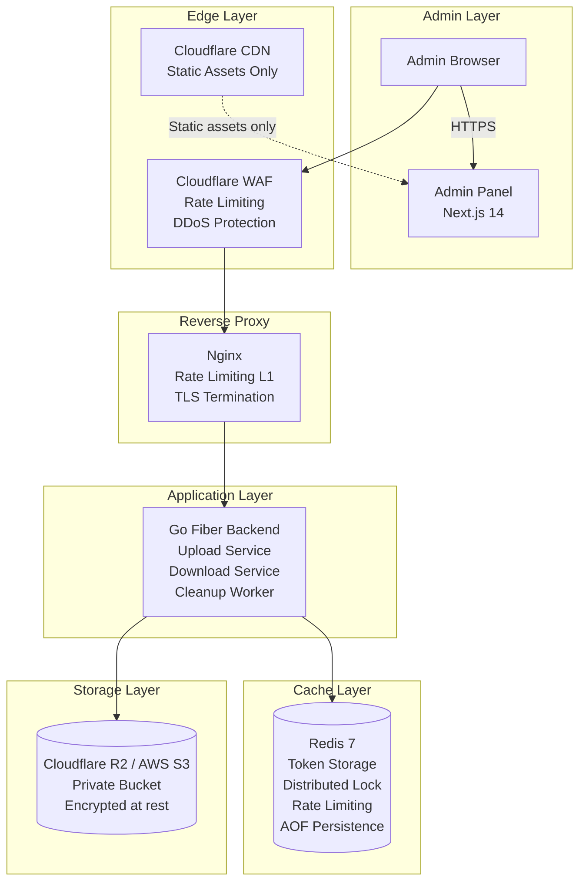
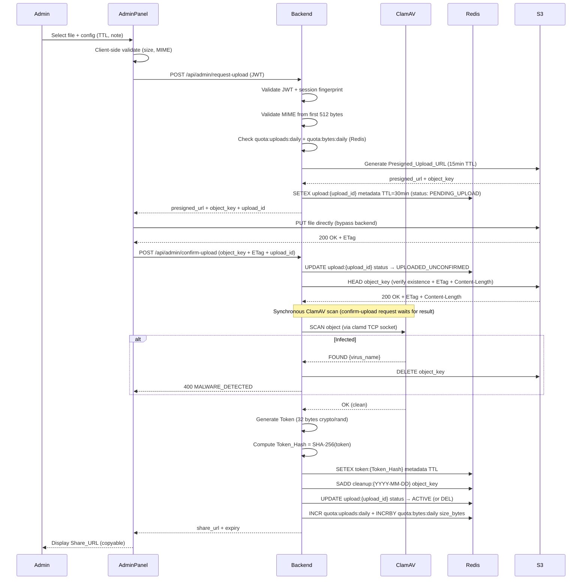
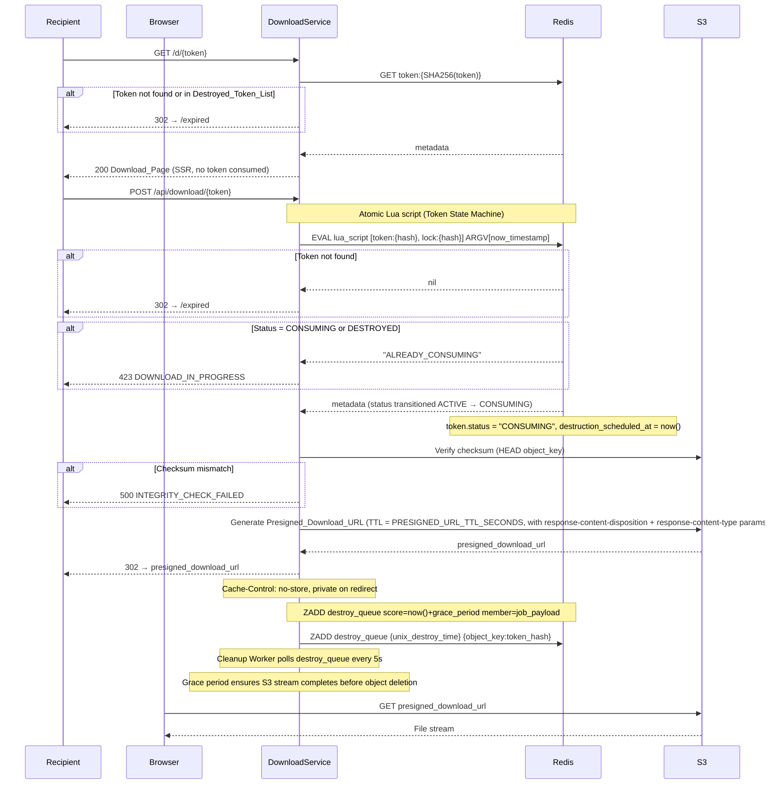
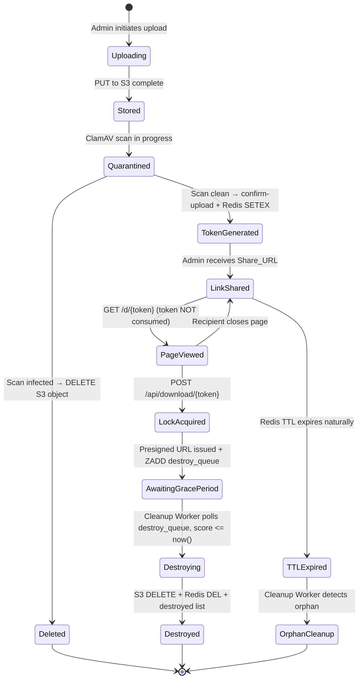

# Design Document — EphemeralShare

## Overview

EphemeralShare là hệ thống chia sẻ file bảo mật cao theo triết lý **zero-retention**: mỗi file chỉ tồn tại trong hệ thống đúng khoảng thời gian tối thiểu cần thiết để chuyển giao đến người nhận, sau đó bị xóa hoàn toàn và không thể phục hồi.

### Core Design Philosophy

> "The best way to protect data is to not have it."

Pipeline cốt lõi:

```
Upload → Store (temp) → Generate Token → Share Link → [GET /d/{token} renders page] → [POST /api/download/{token} consumes token] → Destroy
```

**Quyết định thiết kế quan trọng nhất:** Loại bỏ hoàn toàn database truyền thống. Thay vào đó:

| Thay thế | Mục đích | TTL |
|----------|----------|-----|
| Redis TTL | Token storage, rate limiting, distributed lock | 1 giờ – 7 ngày |
| Object Storage (R2/S3) | File storage tạm thời | Xóa sau download |
| Signed URL | Authorization tích hợp | 15–60 giây |

**Lý do:** Database truyền thống là anti-pattern với ephemeral system — mọi record cần bị xóa ngay sau download, index không có giá trị dài hạn, và persistent storage tạo ra compliance risk không cần thiết.

### Key Design Decisions

1. **POST confirmation flow:** `GET /d/{token}` chỉ render trang thông tin, không consume token. `POST /api/download/{token}` mới acquire lock và trigger destruction. Điều này ngăn browser prefetch, link crawler, và accidental consumption.

2. **Atomic Lua script:** Distributed lock acquisition và token retrieval được thực hiện trong một Redis Lua script duy nhất, loại bỏ TOCTOU race condition.

3. **Idempotent destruction pipeline:** Missing S3 object không fail pipeline — được coi là successful deletion. Mỗi bước tiếp tục độc lập dù bước trước fail.

4. **Checksum verification:** ETag/checksum được verify trước khi issue Presigned_Download_URL để đảm bảo file integrity.

5. **Presigned_Download_URL TTL:** Configurable qua `PRESIGNED_URL_TTL_SECONDS`, default 30s, max 60s — đủ thời gian download nhưng minimize replay window.

6. **Content-Disposition hardening:** Presigned download URL phải include `response-content-disposition: attachment; filename="{sanitized_filename}"` và `response-content-type: {declared_content_type}` parameters. Filename được sanitize: strip path separators, null bytes, control characters. Điều này force browser download (không render inline), ngăn reflected XSS và browser MIME sniffing.

7. **CDN cache bypass:** Tất cả `/d/*`, `/api/*`, `/admin/*` routes không được cache tại CDN edge.

8. **Redis AOF persistence:** Crash recovery cho in-flight tokens, không phải long-term storage.

9. **Grace period destruction:** Redis ZSET delayed job queue (`destroy_queue`) thay vì in-process goroutine sleep. Score = unix timestamp khi cần destroy. Cleanup Worker poll mỗi 5 giây. Đảm bảo S3 stream hoàn tất trước khi object bị xóa, và không mất job khi app restart.

10. **ClamAV malware scanning:** File được scan **synchronous** trong request lifecycle của `confirm-upload`. Token chỉ được activate sau khi scan complete và kết quả là clean. Infected files bị xóa ngay lập tức. Timeout configurable qua `CLAMAV_SCAN_TIMEOUT_SECONDS` (default 60s).

11. **Session fingerprint thay IP binding:** Admin JWT dùng `SessionID` + `GeoRegion` thay vì hard IP binding, tránh UX issues với mobile network, IPv6 rotation, corporate proxy. IP whitelist vẫn là layer riêng biệt.

12. **Minimal disclosure mode:** Khi `MINIMAL_DISCLOSURE_MODE=true`, Download_Page chỉ hiển thị "A file is available for download" thay vì filename, tránh leak qua analytics/logs.

13. **ZSET secondary indexes:** Cleanup worker dùng ZSET indexes (`uploads_pending`, `uploads_unconfirmed`, `cleanup_by_expiry`) thay vì SCAN — O(logN) vs O(N). `ZRANGEBYSCORE` với score=expiry_timestamp cho phép efficient range queries mà không cần scan toàn bộ keyspace.

14. **Destroy queue retry:** Exponential backoff với dead-letter queue (`destroy_dlq`) cho failed destruction jobs. Max retries configurable qua `MAX_DESTROY_RETRIES` (default: 3). Failed jobs sau max retries được move sang `destroy_dlq` và require manual operator intervention.

15. **Refresh token replay detection:** `refresh:{jti}` Redis key (TTL=8h) track valid JTI. Khi refresh: DEL `refresh:{jti}` → issue new token với new JTI. Nếu JTI không tồn tại (replay): revoke toàn bộ session chain + emit CRITICAL audit event `refresh_token_replay_detected`.

16. **CSRF defense-in-depth:** Origin header verification cho cookie-authenticated endpoints (`/api/admin/refresh`, `/api/admin/logout`) là defense-in-depth bên cạnh SameSite=Strict cookie. Nếu Origin mismatch hoặc absent → 403 `CSRF_DETECTED`.

17. **Redis server time for grace period:** Dùng Redis `TIME` command thay vì `time.Now()` để lấy server timestamp khi ZADD vào `destroy_queue`. Tránh NTP clock skew ảnh hưởng grace period calculations khi có nhiều application instances với clock drift khác nhau.

18. **Cleanup worker distributed lock:** `SET cleanup_lock {instance_id} NX EX 60` trước mỗi orphan scan cycle để prevent duplicate work khi scale horizontally. Destroy queue polling không cần lock vì ZREM đảm bảo exactly-once processing.

19. **Redis memory hygiene:** All keys have explicit TTL. ZSET stale entries cleaned via `ZREMRANGEBYSCORE` hourly — `destroy_queue` (>24h), `destroy_dlq` (>7d), `uploads_pending` (>1h), `uploads_unconfirmed` (>1h), `cleanup_by_expiry` (>24h). Prevents unbounded ZSET growth.

20. **Destroy queue deduplication:** `destruction_scheduled_at` + `destroy_job_id` (UUID v4) set atomically in Lua CAS script when token transitions ACTIVE→CONSUMING. Before ZADD `destroy_queue`, check `destruction_scheduled_at != nil` → skip ZADD if already scheduled. Prevents duplicate jobs on request retry.

21. **Presigned URL host validation:** After generating any presigned URL, parse the URL and verify the host matches the configured `S3_ENDPOINT` host. Return `SSRF_ENDPOINT_MISMATCH` error if mismatch. Prevents SSRF via misconfigured endpoint.

22. **IAM-enforced single PUT:** Multipart upload blocked at IAM level via `infra/iam-policy.json` (explicit DENY on CreateMultipartUpload/UploadPart/CompleteMultipartUpload/AbortMultipartUpload), not at application code level. IAM enforcement is more reliable and cannot be bypassed by application bugs.

### Backup and Recovery Policy

> **NO BACKUP POLICY — Data loss is a security feature in this system.**

Hệ thống không có và không được có backup của file data. Backup sẽ phá vỡ toàn bộ zero-retention security model.

- **Redis AOF** là operational persistence (crash recovery), không phải backup. Dữ liệu persist chỉ là token metadata, expire per TTL.
- **S3 versioning phải DISABLED.** Nếu enabled, "deleted" files có thể recover — vi phạm zero-retention guarantee.
- **Operator MUST NOT** enable S3 versioning, S3 replication, S3 Cross-Region Replication, hoặc bất kỳ backup mechanism nào cho bucket này.
- **Nếu Redis data bị mất** (không có AOF): active tokens trở thành invalid — đây là acceptable failure mode, không phải data loss. Recipient sẽ thấy `/expired` page và liên hệ Admin để nhận link mới.
- **Physical media destruction** nằm ngoài phạm vi đảm bảo của hệ thống và phải được xử lý ở cấp độ nhà cung cấp hạ tầng nếu có yêu cầu compliance.

---

## Architecture

### High-Level Architecture



### Upload Sequence



### Download & Destroy Sequence



#### Grace Period Pattern

Thay vì delete S3 object ngay sau khi issue redirect (hoặc sau delay cố định 5s), hệ thống sử dụng **Redis ZSET delayed job queue** thay vì in-process goroutine:

```
destroy_queue (ZSET):
  score = unix_timestamp_when_to_destroy = now() + grace_period
  member = job_payload (object_key:token_hash hoặc JSON)

grace_period = PRESIGNED_URL_TTL_SECONDS + DESTRUCTION_GRACE_SECONDS
```

- `PRESIGNED_URL_TTL_SECONDS`: TTL của presigned URL (default 30s) — đủ thời gian để S3 bắt đầu stream
- `DESTRUCTION_GRACE_SECONDS`: Buffer thêm (default 15s) — đảm bảo S3 stream hoàn tất với mạng chậm hoặc file lớn
- **Default grace_period = 30 + 15 = 45 giây**
- Configurable: `DESTRUCTION_GRACE_SECONDS` environment variable
- Cleanup Worker poll `destroy_queue` mỗi `DESTROY_QUEUE_POLL_INTERVAL_SECONDS` (default 5s): `ZRANGEBYSCORE destroy_queue 0 {now}` → execute destruction → ZREM sau khi complete

**Lý do dùng Redis ZSET thay vì goroutine:** In-process goroutine mất khi app restart, rolling deploy, hoặc panic → orphaned objects. Redis ZSET persist qua restarts, đảm bảo destruction job không bị mất.

**Grace period calculations dùng Redis server time (`TIME` command) để tránh NTP clock skew:** Thay vì `time.Now().Unix()`, hệ thống dùng `REDIS TIME` command để lấy server timestamp khi ZADD vào `destroy_queue`. Điều này đảm bảo grace period không bị ảnh hưởng bởi NTP jump hoặc clock drift giữa các application instances.

**Duplicate scheduling prevention:** Trước khi ZADD vào `destroy_queue`, check `destruction_scheduled_at != nil` trong token metadata. Nếu `destruction_scheduled_at` đã được set (và `destroy_job_id` đã tồn tại) → skip ZADD (job đã được scheduled). Chỉ ZADD nếu `destruction_scheduled_at == nil`. Field `destroy_job_id` (UUID v4) được set trong `FileMetadata` khi schedule destruction.

#### Presigned URL Replay Window

**Tradeoff:** Direct S3 redirect vs Backend streaming proxy

| Approach | Bandwidth | Replay Window | Complexity |
|----------|-----------|---------------|------------|
| Direct S3 redirect (current) | Efficient (S3 serves directly) | 30s (PRESIGNED_URL_TTL_SECONDS) | Low |
| Backend streaming proxy | Expensive (backend proxies all bytes) | Zero (token consumed before stream) | High |

**Quyết định:** Hệ thống chọn **direct S3 redirect** với short TTL (30s default) là acceptable tradeoff cho MVP.

- Presigned URL có thể bị sniff và replay trong TTL window (30s)
- Mitigations: HTTPS only, short TTL, one-time token consumption trước khi URL issued
- **Lưu ý cho enterprise/legal/regulated data:** Presigned URL vẫn có thể leak qua browser history, extensions, proxy logs, HAR exports, corporate MITM appliances. Với các use case này, backend streaming proxy là **near-mandatory**.

#### Future Enhancement: Backend Streaming Proxy

Controlled bởi environment variable `DOWNLOAD_MODE=redirect|stream` (default: `redirect`).

**Flow khi `DOWNLOAD_MODE=stream`:**
```
POST /api/download/{token}
  → Backend acquires token state machine lock (ACTIVE → CONSUMING)
  → Backend calls S3 GetObject (không issue presigned URL)
  → Backend streams file bytes trực tiếp đến client
  → Response headers: Content-Disposition: attachment; filename="{filename}"
  → Destruction pipeline chạy sau khi stream hoàn tất
```

**Advantages:**
- Zero presigned URL exposure — không có URL nào được issue
- No browser history leak, no proxy log leak, no HAR export risk
- Token consumed trước khi bất kỳ byte nào được gửi đến client

**Disadvantages:**
- Tăng bandwidth cost backend (backend phải proxy toàn bộ file)
- Tăng latency (thêm một hop)
- Cần streaming buffer management (`io.Copy` với S3 GetObject stream)
- Không scale tốt với file lớn nếu không có horizontal scaling

**Implementation note:** Dùng Go `io.Copy` với S3 GetObject stream, set `Content-Disposition: attachment; filename="{filename}"`. Khi `DOWNLOAD_MODE=stream`, backend streaming proxy là prerequisite cho Cryptographic Erasure (xem phần Cryptographic Erasure bên dưới).

### Secure Memory Considerations

File content có thể nằm trong RAM, temp buffers, swap, Go GC copies. Những considerations sau là best-effort trong Go runtime:

- **Go streaming:** Dùng `io.Reader` streaming thay vì load toàn bộ file vào memory (`[]byte`). Backend không buffer file content — upload đi thẳng lên S3 qua presigned URL, download đi thẳng từ S3 đến client (hoặc qua `io.Copy` stream khi `DOWNLOAD_MODE=stream`).
- **No temp disk buffering:** Backend SHALL NOT write file content to disk at any point. Upload goes directly to S3 via presigned URL; download goes directly from S3 to client.
- **Swap:** Recommend disable swap trên production server (`swapoff -a`) hoặc dùng encrypted swap để ngăn file content bị swap ra disk.
- **tmpfs:** Nếu cần temp files (e.g., ClamAV scan buffer), mount `/tmp` trên tmpfs (in-memory filesystem, không persist to disk).
- **Memory zeroization:** Go không guarantee memory zeroization sau GC. Best-effort: dùng `runtime.GC()` sau khi xử lý sensitive data, nhưng không rely on this cho compliance.
- **Scope:** Những considerations này là best-effort trong Go runtime. Compliance-level memory protection yêu cầu hardware security modules (HSM) hoặc Trusted Execution Environment (TEE) — ngoài scope MVP.

### CSP Nonce Strategy (Next.js 14)

`script-src 'self'` quá strict cho Next.js 14 production — hydration có thể fail, React runtime issues. Hệ thống dùng **nonce-based CSP** thay thế:

```
Content-Security-Policy: default-src 'self'; script-src 'self' 'nonce-{RANDOM_NONCE}' 'strict-dynamic'; object-src 'none'; frame-ancestors 'none'; base-uri 'none';
```

`{RANDOM_NONCE}` được generate per-request trong Next.js middleware (`crypto.randomBytes(16).toString('base64')`). Next.js middleware inject nonce vào `<script>` tags và CSP header.

```typescript
// middleware.ts
import { NextResponse } from 'next/server'
import crypto from 'crypto'

export function middleware(request: Request) {
  const nonce = crypto.randomBytes(16).toString('base64')
  const cspHeader = `default-src 'self'; script-src 'self' 'nonce-${nonce}' 'strict-dynamic'; object-src 'none'; frame-ancestors 'none'; base-uri 'none';`
  const response = NextResponse.next()
  response.headers.set('Content-Security-Policy', cspHeader)
  response.headers.set('x-nonce', nonce)  // passed to layout for <script nonce={nonce}>
  return response
}
```

Next.js 14 App Router hỗ trợ nonce injection qua `headers()` trong `middleware.ts`. Nginx passes through CSP header set by Next.js (không override).

### File Lifecycle State Machine



---

## Threat Model

| Threat | Likelihood | Impact | Mitigation |
|--------|-----------|--------|------------|
| Token brute force | Low | High | 256-bit entropy, rate limiting, enumeration detection |
| Replay attack (token) | Low | High | Destroyed token list (24h), one-time consumption |
| Replay attack (presigned URL) | Medium | Medium | 30s TTL window, acceptable tradeoff |
| CDN cache leak | Low | High | Cache-Control: no-store, CDN page rules |
| Concurrent token consumption | Low | High | Atomic Redis Lua lock + token state machine |
| Redis compromise | Low | Medium | Hash-only storage (raw token never persisted) |
| S3 bucket exposure | Low | High | Private bucket, UUID keys, IAM role restriction |
| Admin credential theft | Low | Critical | bcrypt + TOTP + IP whitelist + session fingerprint |
| Malware upload | Medium | High | ClamAV scanning, MIME validation |
| Token enumeration | Medium | Medium | Rate limiting, enumeration detection, honeypot tokens |
| Orphaned file persistence | Low | Medium | Cleanup worker + S3 lifecycle rules |
| Redis AOF data exposure | Low | Low | Tokens expire per TTL, hash-only storage |
| Presigned URL sniffing | Low | Medium | 30s TTL, HTTPS only |
| Browser prefetch consumption | Medium | High | POST confirmation flow (GET never consumes) |
| Stale lock / double-download | Low | High | Token state machine (ACTIVE→CONSUMING→DESTROYED) |
| Physical data remnants | Low | Medium | Cryptographic erasure (ENCRYPTION_ENABLED=true) |

---

## Compliance Posture

EphemeralShare được thiết kế với zero-retention philosophy nhưng compliance posture phụ thuộc vào deployment configuration và infrastructure provider.

### Compliance Alignment

| Standard | Status | Notes |
|----------|--------|-------|
| GDPR Right to Erasure | Strong alignment | Files deleted after download, no persistent PII storage. Logical deletion only — physical erasure depends on provider. |
| GDPR Data Minimization | Strong alignment | No user accounts, minimal metadata, audit logs without PII. |
| HIPAA | Not guaranteed | Requires BAA with cloud provider, audit controls, encryption at rest. Enable `ENCRYPTION_ENABLED=true` and use HIPAA-eligible S3/R2. |
| SOC 2 Type II | Possible | Requires audit logging, access controls, incident response procedures. Audit logs (stdout) need external retention. |
| PCI DSS | Not evaluated | Payment card data should not be transmitted via this system. |
| CJIS | Not evaluated | Law enforcement data requires specific controls beyond this system's scope. |

### Infrastructure Trust Assumptions

Hệ thống tin tưởng vào các providers sau:
- **Object Storage provider** (Cloudflare R2 / AWS S3): logical deletion semantics, encryption at rest, no unauthorized access
- **Redis provider**: in-memory data not persisted beyond AOF (Option A) or not at all (Option B/C)
- **Cloudflare**: WAF rules, DDoS protection, no caching of dynamic routes
- **TLS/HTTPS**: end-to-end encryption in transit

### Provider Dependency Risks

| Risk | Mitigation |
|------|-----------|
| S3/R2 logical deletion không physical | Enable `ENCRYPTION_ENABLED=true` (cryptographic erasure) |
| Redis AOF persist to disk | Use Option B/C persistence mode for compliance-critical deployments |
| Cloudflare caches dynamic content | CDN page rules + `Cache-Control: no-store` |
| Cloud provider subpoena | Cryptographic erasure ensures data unreadable even if provider compelled |

### Compliance Recommendations

- **GDPR:** Default configuration is sufficient for most GDPR use cases. Enable `LOG_MINIMIZATION_MODE=true` for stricter data minimization.
- **HIPAA:** Enable `ENCRYPTION_ENABLED=true`, use HIPAA-eligible storage provider, configure audit log retention externally.
- **High-security:** Enable `DOWNLOAD_MODE=stream` + `ENCRYPTION_ENABLED=true` + `REDIS_PERSISTENCE_MODE=ephemeral` + `MINIMAL_DISCLOSURE_MODE=true` + `LOG_MINIMIZATION_MODE=true`.

---

## Components and Interfaces

### Backend — Go Fiber

Single binary với các logical services:

#### Upload Service

```
POST /api/admin/request-upload
  Auth: Bearer JWT (IP-bound)
  Body: { filename, content_type, size_bytes, ttl_hours?, admin_note? }
  Response: { presigned_upload_url, object_key, upload_id, expires_in: 900 }

POST /api/admin/confirm-upload
  Auth: Bearer JWT (IP-bound)
  Body: { object_key, etag, filename, content_type, size_bytes, ttl_hours?, admin_note?, upload_id? }
  Response: { share_url, token_hash, expires_at }

GET /api/admin/tokens
  Auth: Bearer JWT (IP-bound)
  Response: [{ token_hash, filename, expires_at, size_bytes }]

DELETE /api/admin/tokens/{token_hash}
  Auth: Bearer JWT (IP-bound)
  Response: 200 OK
```

#### Auth Service

```
POST /api/admin/login
  Body: { password, totp_code? }
  Response: { access_token, session_id, expires_in: 900 }
  Note: Sets HttpOnly; Secure; SameSite=Strict refresh token cookie (NOT in response body)

POST /api/admin/refresh
  Cookie: refresh_token (HttpOnly)
  Response: { access_token, session_id, expires_in: 900 }
  Note: Issues new session_id on each refresh; sets new refresh token cookie

POST /api/admin/logout
  Cookie: refresh_token (HttpOnly)
  Response: 200 OK
  Note: Clears refresh token cookie
```

**CSRF / Token Storage Strategy:**
- **Access token**: stored in-memory only (React state/context) — không localStorage, không cookie. Mất khi page refresh, re-issue via refresh token cookie.
- **Refresh token**: stored in `HttpOnly; Secure; SameSite=Strict` cookie — không accessible via JavaScript, không cần CSRF token vì SameSite=Strict.
- **Không dùng localStorage** cho bất kỳ token nào.

#### Download Service

```
GET /d/{token}
  Public
  Response: 200 Download_Page (SSR) | 302 /expired

POST /api/download/{token}
  Public
  Response: 302 presigned_download_url | 423 | 500 | 302 /expired
```

#### System Endpoints

```
GET /health
  Public, no rate limit
  Response: { status, redis, storage, version }

GET /expired
  Public
  Response: 200 Expired_Page
```

#### Cleanup Worker

Background goroutine, không expose HTTP endpoint. Chạy mỗi 15 phút với **grace period awareness**, và poll `destroy_queue` ZSET mỗi 5 giây:

```
Cleanup Worker Algorithm:

[Every 5 seconds — Destroy Queue Polling]
1. ZRANGEBYSCORE destroy_queue 0 {now} → get jobs due for destruction
2. Với mỗi job (DestroyJob JSON payload):
   a. Execute destruction pipeline (DELETE S3, DEL token:{hash}, DEL lock:{hash}, SETEX destroyed:{hash})
   b. ZREM destroy_queue {member} sau khi complete
   c. Emit audit log
   d. Nếu S3 delete fail: increment job.Attempt, re-ZADD với score = now() + base_delay * 2^attempt
      - Nếu attempt >= MAX_DESTROY_RETRIES: move to destroy_dlq + emit CRITICAL audit event

[Every 15 minutes — Orphan Scan]
1. ZRANGEBYSCORE uploads_pending 0 {now} → process expired pending uploads
2. ZRANGEBYSCORE uploads_unconfirmed 0 {now} → process expired unconfirmed uploads
3. ZRANGEBYSCORE cleanup_by_expiry 0 {now} → process objects due for cleanup
4. Scan Redis keys cleanup:{date_bucket} cho các date buckets đã quá max TTL
5. Với mỗi object_key trong bucket:
   a. GET token:{hash} từ Redis
   b. Nếu token tồn tại VÀ status = "CONSUMING":
      - Check destruction_scheduled_at
      - Nếu now() - destruction_scheduled_at < MAX_GRACE_PERIOD (default: 5 phút) → SKIP
        (đang trong grace period, job vẫn trong destroy_queue)
      - Nếu now() - destruction_scheduled_at >= MAX_GRACE_PERIOD → treat as stale CONSUMING,
        proceed with deletion (job likely lost)
   c. Nếu token không tồn tại → DELETE S3 object (orphan cleanup)
   d. Nếu token tồn tại VÀ status = "ACTIVE" VÀ age > max TTL → DELETE S3 object
      (TTL expired but token still in Redis — edge case, should not happen normally)
6. SREM cleanup:{date_bucket} object_key sau khi delete
7. Emit structured log event

[Periodic — Upload Session Scan]
1. ZRANGEBYSCORE uploads_pending 0 {now} và uploads_unconfirmed 0 {now} → get expired sessions
2. Nếu S3 object tồn tại nhưng token chưa được activated → DELETE S3 object (orphaned upload)
3. Emit audit log
```

**Retry Strategy for Destruction Failures:**
- Max retries: `MAX_DESTROY_RETRIES` (default: 3)
- Backoff: `base_delay * 2^attempt` (base_delay = 30s)
- Attempt 0: retry after 30s; Attempt 1: 60s; Attempt 2: 120s
- Nếu `attempt >= MAX_DESTROY_RETRIES`: move job to `destroy_dlq` (dead-letter queue ZSET) + emit CRITICAL audit event
- `destroy_dlq` requires manual operator intervention

**Lý do dùng Redis index thay vì S3 LIST:** LIST S3 objects là expensive operation, eventually consistent, và slow khi nhiều objects. Redis index (`cleanup:{date_bucket}` SADD) cho phép lookup O(1) và không phụ thuộc vào S3 consistency.

**S3 lifecycle rule vẫn là safety net** (delete objects > max_ttl + 1 day) — bảo vệ trường hợp cleanup worker fail hoàn toàn.

#### Abuse Prevention

Public endpoint `/d/{token}` là attack surface cần protection:

- **Token enumeration detection:** Nếu IP có > 10 requests với invalid tokens trong 1 phút → block IP 1 giờ + alert admin. Redis key: `enum:{ip}` (count, TTL 60s).
- **Suspicious ASN blocking:** Cloudflare WAF rule để block known datacenter/VPN ASNs (configurable).
- **Bot detection:** Cloudflare Bot Fight Mode — ngăn automated scanning.
- **Honeypot tokens:** Generate fake tokens định kỳ để phát hiện enumeration attack. Implementation details:
  - **Namespace riêng:** Honeypot tokens stored với prefix `honeypot:{hash}` trong Redis (không phải `token:{hash}`) — không bao giờ route đến S3 object thật.
  - **Identical response timing:** Honeypot token lookup phải có cùng latency với real token lookup (dùng Redis pipeline, không short-circuit) — ngăn timing side-channel attack.
  - **Identical response body:** `/d/{honeypot_token}` render Download_Page giống hệt real token (với fake metadata: filename, size, expiry) — không distinguishable với real token.
  - **Trigger alert:** Khi `POST /api/download/{honeypot_token}` được gọi → emit CRITICAL audit event + alert admin ngay lập tức (strong indicator of enumeration attack).
  - **Generation:** Background goroutine generate N honeypot tokens với **random interval**: `base_interval + random_jitter` (`HONEYPOT_BASE_INTERVAL_SECONDS` default 3600, `HONEYPOT_JITTER_SECONDS` default 1800 → effective interval 1–1.5 hours, unpredictable). Random count: `random(HONEYPOT_MIN_COUNT, HONEYPOT_MAX_COUNT)` (default min=3, max=8). Honeypot metadata: realistic TTLs (random 1–48h), realistic filenames (từ common file list), realistic sizes.
  - **Không route thật:** Honeypot tokens không có S3 object tương ứng, không issue presigned URL, không trigger destruction pipeline.

#### Malware Scanning Limitations

ClamAV là baseline protection, không phải comprehensive security solution.

**ClamAV scope:** Commodity malware, known signatures. Phù hợp cho phần lớn use cases thông thường.

**Known gaps:**
- Macro payloads trong Office documents (`.docx`, `.xlsx`, `.pptx`)
- Obfuscated scripts và polyglot files
- Zero-day threats (chưa có signature)
- Steganography payloads (malicious content ẩn trong image/media files)

**Advanced scanning roadmap** (future enhancements, không implement trong MVP):

| Technique | Description | Use Case |
|-----------|-------------|----------|
| CDR (Content Disarm & Reconstruction) | Strip active content từ Office/PDF, rebuild clean version | Office docs từ untrusted sources |
| YARA rules | Custom pattern matching cho specific threat profiles | Targeted threat detection |
| Sandbox detonation | Execute file trong isolated VM, observe behavior | Zero-day và advanced threats |

**Recommendation:** Nếu system xử lý Office documents từ untrusted sources, CDR là priority next step sau MVP. ClamAV + CDR cung cấp defense-in-depth cho document-based threats.

### Frontend — Next.js 14 (App Router)

#### Page Structure

```
app/
  admin/
    page.tsx              → Login page
    dashboard/
      page.tsx            → Upload dashboard (protected)
  d/
    [token]/
      page.tsx            → Download page (SSR)
  expired/
    page.tsx              → Expired link page
  contact/
    page.tsx              → Contact page
```

#### Key Components

- `UploadZone` — Drag & drop với progress bar (Framer Motion)
- `ShareLinkCard` — Copyable URL + expiry countdown
- `TokenList` — Active tokens với revoke button
- `DownloadCard` — File info + one-time warning + download button
- `ExpiredPage` — Explanation + contact options

### Redis Key Schema

| Key Pattern | Value | TTL | Purpose |
|-------------|-------|-----|---------|
| `token:{hash}` | JSON metadata (incl. `status` field) | Configurable (1h–7d) | Token storage + state machine |
| `lock:{hash}` | `"1"` | 30s | Distributed lock (backward compat, short TTL) |
| `destroyed:{hash}` | `"1"` | 24h | Replay prevention |
| `rl:{ip}:{window}` | count | 60s | Rate limiting |
| `failed:{ip}` | count | 10min | Login brute force |
| `cleanup:{YYYY-MM-DD}` | Set of object_keys | max_ttl + 2 days | Cleanup worker index |
| `session:{session_id}` | JSON session data | 8h | Admin session fingerprint |
| `enum:{ip}` | count | 1h (3600s) | Token enumeration detection — block window 1 hour |
| `honeypot:{hash}` | JSON fake metadata | Configurable | Honeypot token (stored separately, never routes to real S3 object) |
| `upload:{upload_id}` | JSON upload session (`{object_key, content_type, size_bytes, admin_id, created_at, status}`) | 30 min | Pending upload tracking, orphan detection |
| `quota:uploads:{YYYY-MM-DD}` | count | Until midnight | Daily upload count quota |
| `quota:bytes:{YYYY-MM-DD}` | bytes | Until midnight | Daily bytes quota |
| `destroy_queue` | ZSET (score=destroy_time, member=job_payload) | N/A (ZSET, no TTL) — stale members (>24h) cleaned hourly via `ZREMRANGEBYSCORE destroy_queue 0 {now-86400}` | Delayed destruction jobs |
| `uploads_pending` | ZSET (score=expiry_ts, member=upload_id) | N/A — stale members (>24h) cleaned hourly via `ZREMRANGEBYSCORE uploads_pending 0 {now-86400}` | Pending upload ZSET index |
| `uploads_unconfirmed` | ZSET (score=expiry_ts, member=upload_id) | N/A | Unconfirmed upload ZSET index |
| `cleanup_by_expiry` | ZSET (score=expiry_ts, member=object_key) | N/A | Cleanup ZSET index |
| `destroy_dlq` | ZSET (score=failed_at, member=job_payload) | N/A | Dead-letter queue for failed destructions |
| `refresh:{jti}` | `"1"` | 8h | Refresh token JTI for replay detection |
| `cleanup_lock` | `{instance_id}` | 60s | Distributed lock for cleanup worker orphan scan cycle — SET NX EX 60, prevents duplicate orphan scan when scaling replicas |

**Note on `token:{hash}` status field:** Token metadata bao gồm `status: "ACTIVE" | "CONSUMING" | "DESTROYED"`. Lua script thực hiện CAS transition atomic. Cleanup worker phải check `status` và `destruction_scheduled_at` trước khi delete.

### Nginx Configuration

```nginx
# Body size and timeout limits (http {} block)
client_max_body_size 500m;      # match Fiber BodyLimit; prevent bandwidth flood before app layer
client_body_timeout 60s;        # timeout for client body upload
client_header_timeout 10s;      # timeout for request headers

# Rate limiting zones
limit_req_zone $binary_remote_addr zone=download:10m rate=5r/m;
limit_req_zone $binary_remote_addr zone=upload:10m rate=2r/m;
limit_req_zone $binary_remote_addr zone=api:10m rate=30r/m;
limit_req_zone $binary_remote_addr zone=request_upload:10m rate=5r/m;  # stricter zone for request-upload

# Security headers (applied globally)
add_header X-Content-Type-Options "nosniff" always;
add_header X-Frame-Options "DENY" always;
add_header Strict-Transport-Security "max-age=31536000; includeSubDomains" always;
add_header Referrer-Policy "no-referrer" always;
add_header Cache-Control "no-store, no-cache, must-revalidate" always;
add_header Server "" always;
add_header Permissions-Policy "geolocation=(), microphone=(), camera=(), payment=()" always;
add_header Cross-Origin-Opener-Policy "same-origin" always;
add_header Cross-Origin-Resource-Policy "same-origin" always;

# CSP for HTML responses — nonce-based (Next.js 14 compatible)
# Note: 'self' alone is too strict for Next.js 14 hydration (React runtime issues)
# Nonce is generated per-request in Next.js middleware and injected into <script> tags
# The actual nonce value is set dynamically; this shows the pattern only
location ~* \.(html)$ {
    # CSP header is set by Next.js middleware (x-nonce header passed to layout)
    # Nginx passes through the CSP header set by the backend/Next.js
    proxy_pass http://frontend:3001;
}

# CDN cache bypass for dynamic routes
location ~ ^/(d/|api/|admin/) {
    add_header Cache-Control "no-store, no-cache, must-revalidate";
    add_header Pragma "no-cache";
    proxy_pass http://backend:3000;
}

# Internal metrics endpoint — NOT exposed publicly
# GET /metrics is proxied only from internal network
location /metrics {
    allow 10.0.0.0/8;
    allow 172.16.0.0/12;
    deny all;
    proxy_pass http://backend:3000;
}
```

---

## Data Models

### FileMetadata (Redis value for `token:{hash}`)

```go
type FileMetadata struct {
    ObjectKey                string    `json:"object_key"`                  // "ep/2024/01/{uuid}"
    OriginalFilename         string    `json:"original_filename"`           // "contract_v2.pdf"
    ContentType              string    `json:"content_type"`                // "application/pdf"
    SizeBytes                int64     `json:"size_bytes"`                  // 2457600
    UploadedAt               time.Time `json:"uploaded_at"`                 // RFC3339
    ExpiresAt                time.Time `json:"expires_at"`                  // RFC3339
    MaxDownloads             int       `json:"max_downloads"`               // always 1
    DownloadCount            int       `json:"download_count"`              // 0 or 1
    ChecksumSHA256           string    `json:"checksum_sha256"`             // hex-encoded SHA-256
    AdminNote                string    `json:"admin_note"`                  // optional
    ScanStatus               string    `json:"scan_status"`                 // "pending" | "clean" | "infected"
    Status                   string    `json:"status"`                      // "ACTIVE" | "CONSUMING" | "DESTROYED"
    DestructionScheduledAt   *time.Time `json:"destruction_scheduled_at,omitempty"` // set when status → CONSUMING
    EncryptedDEK             string    `json:"encrypted_dek,omitempty"`     // base64-encoded encrypted DEK (when ENCRYPTION_ENABLED=true)
    DestroyJobID             string    `json:"destroy_job_id,omitempty"`    // UUID v4, set when destruction scheduled (duplicate scheduling prevention)
}
```

**Note:** `original_filename` SHALL NOT be rendered in SSR HTML when `MINIMAL_DISCLOSURE_MODE=true`. In that mode, the Download_Page displays only "A file is available for download" until the Recipient clicks the download button.

**Note on `status` field:** Token bắt đầu với `status: "ACTIVE"`. Khi `POST /api/download/{token}` acquire lock thành công, Lua script CAS transition sang `"CONSUMING"` và set `destruction_scheduled_at`. Sau khi destruction pipeline hoàn tất, status được set thành `"DESTROYED"` trước khi DEL key.

**Note on `encrypted_dek`:** Chỉ có mặt khi `ENCRYPTION_ENABLED=true`. Là DEK (Data Encryption Key) được encrypt với master key, base64-encoded. DEK bị destroy cùng với token khi DEL `token:{hash}` — đây là cryptographic erasure.

### Token Generation

```go
// TOKEN_ENTROPY_BYTES configurable: min 24 (192-bit), max 32 (256-bit), default 32
// 32 bytes = 256-bit entropy, ~43 chars URL-safe base64
// 24 bytes = 192-bit entropy, ~32 chars URL-safe base64 (collision prob < 1 in 2^96)
entropyBytes := getEnvInt("TOKEN_ENTROPY_BYTES", 32) // default 32
raw := make([]byte, entropyBytes)
crypto/rand.Read(raw)
token := base64.RawURLEncoding.EncodeToString(raw)

// Store hash only — raw token never persisted
hash := sha256.Sum256([]byte(token))
tokenHash := hex.EncodeToString(hash[:])
redisKey := "token:" + tokenHash
```

### Object Storage Key Format

```
ep/{YYYY}/{MM}/{uuid-v4}
Example: ep/2024/01/f47ac10b-58cc-4372-a567-0e02b2c3d479
```

No correlation to original filename. Partitioned by month for efficient listing.

### AuditEvent (stdout JSON)

```go
type AuditEvent struct {
    Timestamp   time.Time `json:"ts"`
    Event       string    `json:"event"`        // "upload_confirmed", "file_destroyed", etc.
    ObjectKey   string    `json:"object_key"`   // NOT filename; truncated to "ep/{YYYY}/{MM}/" when LOG_MINIMIZATION_MODE=true
    TokenHash   string    `json:"token_hash"`   // NOT raw token; truncated to 12 chars when LOG_MINIMIZATION_MODE=true
    AdminIP     string    `json:"admin_ip,omitempty"`      // SHA-256(ip + daily_salt) when LOG_MINIMIZATION_MODE=true
    RecipientIP string    `json:"recipient_ip,omitempty"`  // SHA-256(ip + daily_salt) when LOG_MINIMIZATION_MODE=true
    Success     bool      `json:"success"`
    // Note: When LOG_MINIMIZATION_MODE=true:
    //   - IP addresses are hashed: SHA-256(ip + daily_salt)
    //   - object_key truncated to prefix only: "ep/{YYYY}/{MM}/"
    //   - token_hash truncated to first 12 characters
    //   - Timestamps rounded to nearest hour
    //   - Reduces forensic value but increases privacy
}
```

### Admin JWT Claims

```go
type AdminClaims struct {
    jwt.RegisteredClaims                        // exp: now + 15min
    Role              string `json:"role"`      // always "admin"
    SessionID         string `json:"session_id"` // unique session identifier (stored in Redis)
    GeoRegion         string `json:"geo_region"` // country code at login time (e.g., "VN")
    DeviceFingerprint string `json:"device_fp,omitempty"` // optional: hash(User-Agent + Accept-Language)
}
```

**Session Fingerprint Validation Logic:**
- Thay vì hard reject nếu IP thay đổi (gây UX issues với mobile, IPv6, corporate proxy):
  - Nếu `GeoRegion` thay đổi đột ngột → log geo anomaly + require re-authentication
  - Nếu `DeviceFingerprint` thay đổi → log suspicious activity (không hard reject)
  - `session:{session_id}` Redis key lưu session state (TTL = 8h = refresh token expiry)
- **IP whitelist (`ADMIN_ALLOWED_IPS`) vẫn là layer riêng biệt** — hard reject nếu IP không trong whitelist (nếu được cấu hình)
- `POST /api/admin/refresh` trả về new session ID khi refresh token được sử dụng

### Redis Persistence Philosophy

Hệ thống cung cấp 3 options với tradeoffs rõ ràng:

| Option | Config | Behavior | Use Case |
|--------|--------|----------|----------|
| **A — Operational Persistence (Default)** | `appendonly yes, appendfsync everysec` | Crash recovery, token metadata persist disk tạm thời, expire per TTL | Most deployments |
| **B — Stronger Ephemeral** | `appendonly no` + Redis trên tmpfs | Truly ephemeral, Redis restart = tất cả active tokens invalid (broken links) | Compliance-critical |
| **C — Maximum Security** | No persistence, replica cho HA | Tokens lost on restart, no disk writes | Maximum security |

**Default là Option A.** Operator có thể chọn Option B/C bằng cách set `REDIS_PERSISTENCE_MODE=ephemeral` trong config và điều chỉnh Redis command trong Docker Compose.

**Lưu ý:** Redis AOF là operational persistence (crash recovery), không phải backup. Dữ liệu persist chỉ là token metadata, expire per TTL. Không có file content nào được lưu trong Redis.

### DestroyJob (destroy_queue / destroy_dlq member payload)

```go
type DestroyJob struct {
    V           int    `json:"v"`   // schema version, always 1
    TokenHash   string `json:"th"`  // SHA-256 hex of token
    ObjectKey   string `json:"ok"`  // S3 object key
    ScheduledAt int64  `json:"ts"`  // unix timestamp when scheduled
    Attempt     int    `json:"at"`  // retry attempt count, starts at 0
}
```

Serialized as compact JSON (minified) when ZADD to `destroy_queue` or `destroy_dlq`. Deserialized when polling `destroy_queue`.

### Health Check Response

```go
type HealthResponse struct {
    Status  string `json:"status"`   // "ok" | "degraded"
    Redis   string `json:"redis"`    // "ok" | "unavailable"
    Storage string `json:"storage"`  // "ok" | "unavailable"
    Version string `json:"version"`  // semver
}
```

### Cryptographic Erasure (Advanced)

**Concept:** Per-file Data Encryption Key (DEK). Destroy DEK = cryptographic erasure. Kể cả object remnants còn tồn tại trên storage media cũng vô dụng vì không có key.

**Motivation:** S3 DELETE là logical deletion, không guarantee physical destruction. Cloud provider replication, block remnants, storage internals có thể còn tồn tại. Cryptographic erasure giải quyết vấn đề này mà không cần physical media destruction.

**Encryption Algorithm:** **XChaCha20-Poly1305** (`golang.org/x/crypto/chacha20poly1305`)
- 192-bit nonce — an toàn cho random nonce generation (không cần nonce counter management như AES-GCM)
- Chunk-based streaming: chia file thành chunks (default 64KB), encrypt mỗi chunk độc lập
- Nonce = `nonce_prefix (16 bytes random per file) || chunk_counter (8 bytes little-endian)`
- `nonce_prefix` stored trong Redis token metadata
- Library: `golang.org/x/crypto/chacha20poly1305`

**Flow:**

```
Upload (ENCRYPTION_ENABLED=true):
  1. Generate DEK (32 bytes, crypto/rand) per file
  2. Generate nonce_prefix (16 bytes, crypto/rand) per file
  3. Encrypt file với XChaCha20-Poly1305 using DEK, chunk-based (64KB chunks)
     - Each chunk nonce = nonce_prefix || chunk_counter (8 bytes LE)
  4. Encrypt DEK với master key (XChaCha20-Poly1305, MASTER_ENCRYPTION_KEY env var)
  5. Store encrypted DEK + nonce_prefix trong Redis metadata: token:{hash}
  6. Upload encrypted blob to S3

Download (ENCRYPTION_ENABLED=true, requires DOWNLOAD_MODE=stream):
  1. Retrieve encrypted DEK + nonce_prefix from Redis metadata
  2. Decrypt DEK using master key
  3. Backend calls S3 GetObject for encrypted blob
  4. Backend decrypts stream using DEK + nonce_prefix (XChaCha20-Poly1305, chunk-based)
  5. Backend streams decrypted bytes directly to client
  6. Destruction pipeline runs after stream completes

Destruction:
  1. DEL token:{hash} from Redis → encrypted DEK + nonce_prefix destroyed with token
  2. DELETE S3 object (encrypted blob — now unreadable without DEK)
  3. Even if S3 object persists due to provider internals, it's cryptographically unreadable
```

**Tradeoffs:**
- Requires `DOWNLOAD_MODE=stream` — không thể dùng direct S3 redirect với encrypted blob
- Tăng complexity đáng kể (key management, streaming decryption)
- Tăng CPU usage (XChaCha20-Poly1305 encryption/decryption)
- Không implement trong MVP redirect mode

**Master key management:**
- DEK được encrypt với master key stored in `MASTER_ENCRYPTION_KEY` environment variable (32-byte hex)
- Rotate master key = re-encrypt all active DEKs (operational procedure, không tự động)
- Master key MUST be stored securely (e.g., HashiCorp Vault, AWS Secrets Manager) — không hardcode

**Environment variables:**
- `ENCRYPTION_ENABLED=false` (default) — set `true` để enable per-file DEK encryption
- `MASTER_ENCRYPTION_KEY` — required khi `ENCRYPTION_ENABLED=true`, 32-byte hex string

### Atomic Lua Script (Token State Machine + Lock Acquisition)

Thay vì chỉ dùng distributed lock đơn giản, hệ thống sử dụng **token state machine** để ngăn stale lock và double-download race condition. Token có thêm field `status` với các trạng thái: `"ACTIVE"`, `"CONSUMING"`, `"DESTROYED"`.

**Vấn đề với lock-based approach cũ:** `SET lock:{hash} NX EX 30` có thể expire sớm nếu download lớn hơn 30s, backend crash, hoặc goroutine stuck — request khác có thể acquire lock lần 2 → double-download race.

**Token State Machine Transitions:**
- `ACTIVE → CONSUMING`: khi `POST /api/download/{token}` acquire lock thành công
- `CONSUMING → DESTROYED`: khi destruction pipeline hoàn tất

```lua
-- KEYS[1] = "token:{hash}"
-- KEYS[2] = "lock:{hash}" (kept for backward compat, short TTL)
-- ARGV[1] = current timestamp (Unix seconds, as string)
-- Returns: nil (not found) | "ALREADY_CONSUMING" (state conflict) | metadata JSON (success)
local meta_str = redis.call('GET', KEYS[1])
if not meta_str then return nil end
local meta = cjson.decode(meta_str)
if meta.status == 'CONSUMING' or meta.status == 'DESTROYED' then
  return 'ALREADY_CONSUMING'
end
meta.status = 'CONSUMING'
meta.destruction_scheduled_at = ARGV[1]  -- current timestamp
redis.call('SET', KEYS[1], cjson.encode(meta))
redis.call('SET', KEYS[2], '1', 'NX', 'EX', '30')  -- short lock for backward compat
return meta_str
```

This script runs atomically in Redis — no interleaving possible between GET and SET.

**Return values:**
- `nil`: token không tồn tại → redirect to `/expired`
- `"ALREADY_CONSUMING"`: token đang trong trạng thái CONSUMING hoặc DESTROYED → return HTTP 423 `DOWNLOAD_IN_PROGRESS`
- metadata JSON: lock acquired thành công, trả về metadata gốc (trước khi update status)

**Stale CONSUMING detection:** Cleanup worker và download handler phải check `destruction_scheduled_at`. Nếu `now() - destruction_scheduled_at >= MAX_GRACE_PERIOD` (default 5 phút), token được coi là stale CONSUMING và có thể được cleanup.

### Docker Compose Services

```yaml
services:
  backend:
    image: ephemeral-share-backend:latest
    environment:
      - REDIS_URL=redis://redis:6379
      - S3_BUCKET=ephemeral-share
      - PRESIGNED_URL_TTL_SECONDS=30        # default 30, max 60
      - DESTRUCTION_GRACE_SECONDS=15        # grace_period = PRESIGNED_URL_TTL + this value
      - MAX_GRACE_PERIOD_SECONDS=300        # stale CONSUMING token threshold (default: 5 min)
      - ADMIN_ALLOWED_IPS=                  # optional IP whitelist (hard reject if set)
      - TOTP_ENABLED=false
      - TOKEN_ENTROPY_BYTES=32              # min: 24, max: 32 (default: 32 for max security)
      - CLAMAV_ENABLED=true
      - CLAMAV_URL=tcp://clamav:3310
      - MINIMAL_DISCLOSURE_MODE=false       # if true, hide filename on download page
      - DOWNLOAD_MODE=redirect              # "redirect" (default) | "stream" (backend proxy)
      - ENCRYPTION_ENABLED=false            # if true, per-file DEK encryption (requires DOWNLOAD_MODE=stream)
      - MASTER_ENCRYPTION_KEY=              # 32-byte hex key (required when ENCRYPTION_ENABLED=true)
      - LOG_MINIMIZATION_MODE=false         # if true, hash IPs, truncate keys/hashes, round timestamps; token_hash truncated to 12 chars
      - HONEYPOT_BASE_INTERVAL_SECONDS=3600 # base interval for honeypot generation (default: 1 hour)
      - HONEYPOT_JITTER_SECONDS=1800        # random jitter added to base interval (default: 30 min)
      - HONEYPOT_MIN_COUNT=3                # minimum honeypot tokens per generation cycle
      - HONEYPOT_MAX_COUNT=8                # maximum honeypot tokens per generation cycle
      - CLAMAV_SCAN_TIMEOUT_SECONDS=60      # timeout for synchronous ClamAV scan (default: 60s)
      - MAX_DAILY_UPLOADS=100               # daily upload count quota (default: 100)
      - MAX_DAILY_BYTES=10737418240         # daily bytes quota (default: 10GB)
      - DESTROY_QUEUE_POLL_INTERVAL_SECONDS=5 # how often cleanup worker polls destroy_queue (default: 5s)
      - MAX_DESTROY_RETRIES=3               # max retry attempts for failed destruction jobs (default: 3)
      - CLAMAV_MAX_CONCURRENT_SCANS=3       # max concurrent ClamAV scans (default: 3)
      - ALLOWED_ORIGIN=https://yourdomain.com # allowed origin for CSRF check on cookie endpoints
      - HONEYPOT_RESPONSE_JITTER_MS=50      # max random jitter (ms) added to honeypot responses (default: 50)
      - MAX_PENDING_UPLOADS_PER_ADMIN=5     # max concurrent pending upload sessions per admin (default: 5)
      - MAX_TOTAL_PENDING_UPLOADS=50        # global max pending uploads across all admins (default: 50)
    deploy:
      resources:
        limits: { cpus: '1.0', memory: 512M }

  frontend:
    image: ephemeral-share-frontend:latest
    environment:
      - BACKEND_INTERNAL_URL=http://backend:3000  # internal network URL for SSR fetches (avoids public Nginx loop)
    deploy:
      resources:
        limits: { cpus: '0.5', memory: 256M }

  redis:
    image: redis:7-alpine
    # Persistence options:
    # Option A (Default — Operational Persistence): crash recovery, tokens persist per TTL
    command: redis-server --appendonly yes --appendfsync everysec
    # Option B (Stronger Ephemeral): truly ephemeral, Redis restart = all tokens invalid
    # command: redis-server --appendonly no
    # Option C (Maximum Security): no persistence, use replica for HA
    # command: redis-server --save ""
    deploy:
      resources:
        limits: { cpus: '0.5', memory: 256M }

  clamav:
    image: clamav/clamav:latest
    ports:
      - "3310:3310"
    environment:
      - CLAMAV_NO_FRESHCLAMD=false
    deploy:
      resources:
        limits: { cpus: '1.0', memory: 1G }  # ClamAV requires ~500MB for virus DB

  nginx:
    image: nginx:alpine
    ports: ["443:443", "80:80"]
```

---

## Correctness Properties

*A property is a characteristic or behavior that should hold true across all valid executions of a system — essentially, a formal statement about what the system should do. Properties serve as the bridge between human-readable specifications and machine-verifiable correctness guarantees.*

### Property 1: Object Key Format Invariant

*For any* presigned upload URL request with a valid Admin_JWT, the generated Object_Storage key SHALL match the format `ep/{YYYY}/{MM}/{uuid-v4}` and SHALL contain no substring derived from the original filename.

**Validates: Requirements 2.2, 7.2**

---

### Property 2: Token Generation — Entropy and Hash-Only Storage

*For any* token generated by the Upload_Service, the token SHALL be URL-safe base64 of exactly `TOKEN_ENTROPY_BYTES` random bytes (configurable: 24–32 bytes, default 32), and the value stored in Redis under `token:{key}` SHALL be the SHA-256 hex digest of the token, not the raw token itself. For `TOKEN_ENTROPY_BYTES=32`, the collision probability SHALL be less than 1 in 2^128; for `TOKEN_ENTROPY_BYTES=24`, less than 1 in 2^96.

**Validates: Requirements 2.7, 2.8, 15.4**

---

### Property 3: Token Metadata Round-Trip

*For any* valid upload confirmation, the metadata stored in Redis under `token:{SHA256(token)}` SHALL contain all required fields (`object_key`, `original_filename`, `content_type`, `size_bytes`, `uploaded_at`, `expires_at`, `max_downloads`, `download_count`, `checksum_sha256`, `admin_note`) with values matching those submitted at upload time.

**Validates: Requirements 2.6, 3.1, 15.2**

---

### Property 4: TTL Configuration Fidelity

*For any* TTL value in the range [1, 168] hours specified by Admin at upload time, the Redis key `token:{hash}` SHALL have a TTL within ±1 second of the specified value immediately after creation.

**Validates: Requirements 3.2**

---

### Property 5: GET Never Consumes Token

*For any* valid token, making any number of `GET /d/{token}` requests SHALL leave the token unconsumed: the Redis key `token:{hash}` SHALL still exist, the Distributed_Lock `lock:{hash}` SHALL NOT be acquired, and the `download_count` field SHALL remain unchanged after all GET requests.

**Validates: Requirements 4.1, 4.3, 11.3**

---

### Property 6: Destruction Completeness and Idempotence

*For any* token that has been successfully consumed via `POST /api/download/{token}`, after the destruction pipeline completes: (a) the S3 object SHALL not exist, (b) `token:{hash}` SHALL not exist in Redis, (c) `lock:{hash}` SHALL not exist in Redis, and (d) `destroyed:{hash}` SHALL exist in Redis with a TTL of approximately 24 hours. Furthermore, the token state machine SHALL have transitioned `ACTIVE → CONSUMING` (at lock acquisition) and `CONSUMING → DESTROYED` (at pipeline completion). Running the destruction pipeline a second time on the same token SHALL produce the same final state without error.

**Validates: Requirements 4.9, 4.10**

---

### Property 7: Destroyed Token Rejection

*For any* token that has been consumed and added to the Destroyed_Token_List, all subsequent `GET /d/{token}` requests SHALL return HTTP 302 to `/expired`, and all subsequent `POST /api/download/{token}` requests SHALL return HTTP 302 to `/expired` or HTTP 423, regardless of how much time has elapsed since destruction (within the 24-hour Destroyed_Token_List TTL).

**Validates: Requirements 4.13, 15.3**

---

### Property 8: No Internal Identifiers in Responses

*For any* HTTP response sent to a Recipient (including 302 redirect responses, error responses, and the Download_Page HTML), the response body and headers SHALL contain no S3 object key, bucket name, Redis key, token hash, or any other internal system identifier.

**Validates: Requirements 4.14**

---

### Property 9: Concurrent Download Exclusivity

*For any* valid token with `status = "ACTIVE"`, when N concurrent `POST /api/download/{token}` requests arrive simultaneously (N ≥ 2), exactly one request SHALL perform the CAS transition `ACTIVE → CONSUMING` and receive a 302 redirect to the Presigned_Download_URL, and all remaining N-1 requests SHALL receive HTTP 423 with error code `DOWNLOAD_IN_PROGRESS`. Furthermore, *for any* token with `status = "CONSUMING"` or `status = "DESTROYED"`, all `POST /api/download/{token}` requests SHALL return HTTP 423 with error code `DOWNLOAD_IN_PROGRESS` (the `ALREADY_CONSUMING` Lua script return value).

**Validates: Requirements 5.1, 5.3**

---

### Property 10: Orphan Cleanup Completeness

*For any* S3 object with prefix `ep/` whose age exceeds the maximum configured TTL and for which no corresponding Redis key `token:{hash}` exists, the Cleanup_Worker SHALL delete the object from Object_Storage within one cleanup cycle (15 minutes).

**Validates: Requirements 6.2**

---

### Property 11: Security Headers on All Responses

*For any* HTTP response from the system (any endpoint, any status code), the response SHALL include all of the following headers: `X-Content-Type-Options: nosniff`, `X-Frame-Options: DENY`, `Strict-Transport-Security: max-age=31536000; includeSubDomains`, `Referrer-Policy: no-referrer`, `Cache-Control: no-store, no-cache, must-revalidate`, an empty `Server` header, `Permissions-Policy: geolocation=(), microphone=(), camera=(), payment=()`, `Cross-Origin-Opener-Policy: same-origin`, and `Cross-Origin-Resource-Policy: same-origin`. Furthermore, *for any* HTML response, the response SHALL include a `Content-Security-Policy` header using nonce-based CSP: `default-src 'self'; script-src 'self' 'nonce-{N}' 'strict-dynamic'; object-src 'none'; frame-ancestors 'none'; base-uri 'none';` where `{N}` is a per-request cryptographically random nonce (16 bytes, base64-encoded), and the same nonce SHALL be present in all `<script>` tags in the HTML. And *for any* response from `/d/*`, `/api/*`, or `/admin/*` routes, the response SHALL NOT contain stack traces, internal error messages, or system version information.

**Validates: Requirements 9.1, 9.2, 9.5, 9.6, 9.7, 9.8**

---

### Property 12: Audit Log Completeness and No Sensitive Data

*For any* key system event (upload initiated, upload confirmed, download link accessed, file destroyed, orphan cleaned, admin login success, admin login failure, suspicious activity detected), the system SHALL emit a structured JSON log event to stdout containing all required fields (`ts`, `event`, `object_key`, `token_hash`, `success`), and the log event SHALL NOT contain file content, original filenames, raw tokens, admin passwords, or any other sensitive data.

**Validates: Requirements 13.1, 13.2, 13.3**

---

### Property 13: Token Uniqueness

*For any* set of N independently generated tokens (N up to 10,000 in testing), no two tokens SHALL be identical, and no two token hashes SHALL be identical, consistent with the collision probability bound: less than 1 in 2^128 for `TOKEN_ENTROPY_BYTES=32`, and less than 1 in 2^96 for `TOKEN_ENTROPY_BYTES=24`.

**Validates: Requirements 15.1**

---

### Property 14: MIME Validation Rejects Mismatches

*For any* file upload request where the MIME type detected from the first 512 bytes of file content does not match the declared `content_type`, the Upload_Service SHALL reject the request with HTTP 400 and error code `INVALID_CONTENT_TYPE`. Similarly, *for any* declared `content_type` not in the system's allowed MIME type list, the request SHALL be rejected regardless of file content.

**Validates: Requirements 2.4, 2.9**

---

### Property 15: Download Page Metadata Display

*For any* valid token with associated metadata, the server-side rendered Download_Page SHALL contain the original filename (or "A file is available for download" when `MINIMAL_DISCLOSURE_MODE=true`), file size in human-readable format, file content type, and the remaining time until link expiry derived from the `expires_at` field in Redis metadata.

**Validates: Requirements 11.1**

---

### Property 16: Presigned URL TTL Bound

*For any* presigned download URL generated by the Download_Service, the URL SHALL expire within `PRESIGNED_URL_TTL_SECONDS` seconds of issuance (default 30s, maximum 60s). Any attempt to use the presigned URL after this TTL SHALL be rejected by Object_Storage with an authentication error.

**Validates: Requirements 4.5**

---

### Property 17: Cryptographic Erasure

*For any* token where `ENCRYPTION_ENABLED=true`, after the destruction pipeline completes (token DEL from Redis), the S3 object containing the encrypted blob SHALL be unreadable without the DEK. Specifically: (a) the DEK is destroyed when `token:{hash}` is deleted from Redis, (b) the encrypted blob in S3 SHALL be indistinguishable from random bytes without the DEK, and (c) even if the S3 object persists due to provider internals, decryption SHALL fail without the DEK. This property holds regardless of whether the S3 DELETE operation succeeds.

**Validates: Requirements 7.6 (logical deletion + cryptographic erasure as defense-in-depth)**

---

## Error Handling

### Error Response Format

All API errors return a consistent JSON structure:

```json
{
  "error": "ERROR_CODE",
  "message": "Human-readable description",
  "retry_after": 30
}
```

**Critical:** Error responses MUST NOT include stack traces, internal paths, Redis keys, S3 keys, or any system internals.

### Error Codes

| HTTP Status | Error Code | Scenario |
|-------------|------------|----------|
| 400 | `FILE_TOO_LARGE` | File size > 500 MB |
| 400 | `INVALID_CONTENT_TYPE` | MIME type not allowed or mismatch |
| 400 | `MALWARE_DETECTED` | ClamAV scan found infected file |
| 400 | `UPLOAD_SIZE_MISMATCH` | Confirmed upload size does not match declared size |
| 400 | `MULTIPART_NOT_ALLOWED` | Upload must be single PUT, not multipart |
| 400 | `ZIP_BOMB_DETECTED` | Office document ZIP compression ratio exceeds safe limit |
| 400 | `UPLOAD_NOT_FOUND` | S3 object not found after upload (eventual consistency retry exhausted) |
| 401 | `UNAUTHORIZED` | Missing or invalid Admin_JWT |
| 401 | `SESSION_INVALID` | JWT session fingerprint mismatch or geo anomaly |
| 403 | `ACCESS_DENIED` | IP not in whitelist |
| 403 | `CSRF_DETECTED` | Origin header mismatch on cookie-authenticated endpoint |
| 423 | `DOWNLOAD_IN_PROGRESS` | Distributed lock held by concurrent request |
| 429 | `RATE_LIMIT_EXCEEDED` | Rate limit hit (includes `Retry-After` header) |
| 429 | `TOKEN_ENUMERATION_DETECTED` | IP blocked for excessive invalid token attempts (extended block: 1 hour) |
| 429 | `QUOTA_EXCEEDED` | Daily upload count or bytes quota exceeded |
| 429 | `TOO_MANY_PENDING_UPLOADS` | Concurrent pending upload sessions limit exceeded |
| 429 | `SYSTEM_OVERLOADED` | Global pending upload limit exceeded (MAX_TOTAL_PENDING_UPLOADS) |
| 500 | `INTEGRITY_CHECK_FAILED` | Checksum mismatch before issuing presigned URL |
| 500 | `SSRF_ENDPOINT_MISMATCH` | Generated presigned URL host does not match configured S3 endpoint |
| 500 | `INTERNAL_ERROR` | Unexpected server error (no details exposed) |
| 503 | `SERVICE_UNAVAILABLE` | Redis or S3 unavailable |
| 503 | `SCAN_TIMEOUT` | ClamAV scan exceeded CLAMAV_SCAN_TIMEOUT_SECONDS |
| 503 | `SCAN_QUEUE_FULL` | ClamAV concurrent scan limit reached |

### Destruction Pipeline Error Handling

The destruction pipeline is designed to be resilient and idempotent:

```
Step 1: DELETE S3 object
  - If 404 (already deleted): treat as success, continue
  - If other error: log error, continue to step 2

Step 2: DEL token:{hash} from Redis
  - If key not found: treat as success, continue
  - If error: log error, continue to step 3

Step 3: DEL lock:{hash} from Redis
  - If key not found: treat as success, continue
  - If error: log error, continue to step 4

Step 4: SETEX destroyed:{hash} "1" 86400
  - If error: log error (critical — replay prevention may be compromised)
  - Emit audit log event regardless
```

**Rationale:** Aborting the pipeline on any step failure would leave artifacts in an inconsistent state. Continuing ensures maximum cleanup even in partial failure scenarios.

### Upload Pipeline Error Handling

```
Step 1: Validate JWT → 401 if invalid
Step 2: Validate MIME/size → 400 if invalid
Step 3: Generate presigned upload URL → 503 if S3 unavailable
Step 4: [Client uploads to S3]
Step 5: Confirm upload (HEAD object) → if object not found, return 400 UPLOAD_NOT_FOUND
Step 6: Store metadata in Redis → if Redis unavailable, DELETE S3 object, return 503
Step 7: Return Share_URL
```

If step 6 fails after step 4 succeeds, the orphaned S3 object is deleted immediately (not left for cleanup worker).

### Concurrent Request Handling

```
Scenario: Two POST /api/download/{token} arrive simultaneously (token status = ACTIVE)

Request A: Lua script → GET token (found, status=ACTIVE) → CAS ACTIVE→CONSUMING (success) → returns metadata
Request B: Lua script → GET token (found, status=CONSUMING) → returns "ALREADY_CONSUMING"

Request A: proceeds to generate presigned URL, schedule destruction goroutine
Request B: receives 423 DOWNLOAD_IN_PROGRESS with retry_after: 30
```

The Lua script atomicity guarantees this behavior even under high concurrency. The token state machine ensures that even if the `lock:{hash}` key expires (e.g., after 30s), the `status=CONSUMING` field in the token metadata prevents double-download — a second request will see `ALREADY_CONSUMING` and return 423.

---

## Observability

### Structured Logging

Tất cả logs được emit ra stdout dưới dạng JSON (đã mô tả trong `AuditEvent`). Log shipper options:
- **Vector** → Loki (recommended cho self-hosted)
- **Fluentd** → Loki / Elasticsearch
- **Docker log driver** → CloudWatch / Datadog

### Metrics (Prometheus)

Backend expose `GET /metrics` endpoint (Prometheus format, internal only — không expose qua Nginx public):

| Metric | Type | Labels | Description |
|--------|------|--------|-------------|
| `ephemeral_downloads_total` | Counter | `status` (success/failed/expired) | Total download attempts |
| `ephemeral_destruction_duration_seconds` | Histogram | — | Time from lock acquired to destruction complete |
| `ephemeral_orphan_cleanup_total` | Counter | `status` (deleted/error) | Orphan cleanup operations |
| `ephemeral_lock_contention_total` | Counter | — | Times a download was blocked by existing lock |
| `ephemeral_presigned_url_generation_failures_total` | Counter | — | Presigned URL generation failures |
| `ephemeral_token_consumption_latency_seconds` | Histogram | — | End-to-end latency from POST to 302 redirect |
| `ephemeral_active_tokens_gauge` | Gauge | — | Current number of active tokens in Redis |
| `ephemeral_active_uploads_gauge` | Gauge | — | Current pending/unconfirmed uploads |
| `ephemeral_destroy_queue_size` | Gauge | — | Current size of destroy_queue ZSET |
| `ephemeral_orphan_cleanup_duration_seconds` | Histogram | — | Duration of each cleanup cycle |
| `ephemeral_malware_detections_total` | Counter | — | ClamAV FOUND events |
| `ephemeral_s3_failures_total` | Counter | `operation` (upload/download/delete/head) | S3 operation failures |
| `ephemeral_redis_lua_contention_total` | Counter | — | ALREADY_CONSUMING returns from Lua script |
| `ephemeral_honeypot_hits_total` | Counter | — | Honeypot token accesses |
| `ephemeral_presigned_url_generation_latency_seconds` | Histogram | — | Presigned URL generation latency |
| `ephemeral_destroy_dlq_size` | Gauge | — | Dead-letter queue size (failed destruction jobs) |
| `ephemeral_clamav_scan_duration_seconds` | Histogram | — | ClamAV scan duration per file |
| `ephemeral_clamav_concurrent_scans` | Gauge | — | Current concurrent ClamAV scans in progress |
| `ephemeral_destroy_retries_total` | Counter | — | Total destruction retry attempts |
| `ephemeral_destroy_oldest_job_seconds` | Gauge | — | Age (seconds) of oldest job in destroy_queue; alert if > grace_period * 3 (queue stuck indicator) |

### Tracing (OpenTelemetry)

Optional distributed tracing cho upload và download flows. Instrument với `go.opentelemetry.io/otel`. Trace context propagated qua `traceparent` header.

### Alerting

3 critical alerts (Prometheus Alertmanager → PagerDuty/Telegram):

| Alert | Condition | Severity |
|-------|-----------|----------|
| Download success rate low | `rate(ephemeral_downloads_total{status="success"}[5m]) / rate(ephemeral_downloads_total[5m]) < 0.99` | Critical |
| Redis memory high | Redis memory usage > 80% of limit | Warning |
| Orphan cleanup failures | `increase(ephemeral_orphan_cleanup_total{status="error"}[1h]) > 0` | Warning |

### Minimal Monitoring Stack

Cho self-hosted deployments không có Prometheus:
- **Uptime Kuma** — monitor `GET /health` endpoint (free, self-hosted)
- Alert via Telegram/Email khi `/health` trả về non-200

---

## Testing Strategy

### Overview

This feature uses a **dual testing approach**:
- **Unit tests**: Verify specific examples, edge cases, and error conditions
- **Property-based tests**: Verify universal properties across all inputs

Property-based testing is appropriate here because the core logic involves token generation (pure functions with large input space), metadata storage/retrieval (round-trip properties), destruction pipeline (idempotence), and security invariants (universal properties over all inputs).

### Property-Based Testing Library

**Go:** [`pgregory.net/rapid`](https://github.com/flyingmutant/rapid) — native Go PBT library with shrinking support.

Each property test runs a minimum of **100 iterations** with randomized inputs.

Tag format: `// Feature: ephemeral-share, Property {N}: {property_text}`

### Property Tests

Each correctness property maps to one property-based test:

| Property | Test Function | Generators |
|----------|--------------|------------|
| P1: Object key format | `TestObjectKeyFormat` | Random filenames, content types |
| P2: Token entropy + hash storage | `TestTokenGenerationAndStorage` | N independent token generations, varying TOKEN_ENTROPY_BYTES |
| P3: Metadata round-trip | `TestMetadataRoundTrip` | Random FileMetadata structs (including scan_status, status, destruction_scheduled_at, encrypted_dek) |
| P4: TTL configuration fidelity | `TestTTLConfiguration` | Random TTL in [1, 168] hours |
| P5: GET never consumes token | `TestGETDoesNotConsumeToken` | Random tokens, random N GET requests |
| P6: Destruction completeness + idempotence | `TestDestructionIdempotence` | Random tokens with S3 objects; verify state machine ACTIVE→CONSUMING→DESTROYED |
| P7: Destroyed token rejection | `TestDestroyedTokenRejection` | Random consumed tokens |
| P8: No internal identifiers in responses | `TestNoInternalIdentifiersInResponses` | Random tokens, all endpoint types |
| P9: Concurrent download exclusivity | `TestConcurrentDownloadExclusivity` | Random tokens (ACTIVE status), N=2..10 concurrent requests; also test CONSUMING/DESTROYED tokens return ALREADY_CONSUMING |
| P10: Orphan cleanup completeness | `TestOrphanCleanupCompleteness` | Random orphaned objects (via Redis cleanup index) |
| P11: Security headers + CSP nonce | `TestSecurityHeadersOnAllResponses` | Random endpoints, random request types; verify nonce uniqueness per request, nonce present in both CSP header and script tags |
| P12: Audit log completeness | `TestAuditLogCompletenessAndNoSensitiveData` | Random events of each type; verify minimization when LOG_MINIMIZATION_MODE=true |
| P13: Token uniqueness | `TestTokenUniqueness` | N=10,000 token generations, both entropy levels |
| P14: MIME validation | `TestMIMEValidationRejectsMismatches` | Random file content + declared MIME pairs |
| P15: Download page metadata | `TestDownloadPageMetadataDisplay` | Random FileMetadata structs, both disclosure modes |
| P16: Presigned URL TTL bound | `TestPresignedURLTTLBound` | Random presigned URLs, verify expiry within TTL |
| P17: Cryptographic erasure | `TestCryptographicErasure` | Random file content + DEK pairs; verify encrypted blob unreadable without DEK after token destruction (ENCRYPTION_ENABLED=true) |

### Unit Tests

Unit tests focus on specific examples and edge cases not covered by property tests:

**Auth:**
- Valid login issues JWT with correct expiry and session_id
- Invalid password returns 401 with 500ms delay
- 5 failed attempts triggers 15-minute lockout
- JWT with geo anomaly (country code change) requires re-authentication
- JWT with device fingerprint change logs suspicious activity (no hard reject)
- IP whitelist hard rejects non-whitelisted IPs (when ADMIN_ALLOWED_IPS configured)
- TOTP required when enabled
- Refresh token issues new session_id

**Upload:**
- File size exactly 500 MB is accepted; 500 MB + 1 byte is rejected
- Upload pipeline failure after S3 upload cleans up orphaned object
- Default TTL of 24 hours applied when not specified
- ClamAV scan: clean file activates token
- ClamAV scan: infected file deletes S3 object and returns 400 MALWARE_DETECTED
- ClamAV disabled: token activated without scan (CLAMAV_ENABLED=false)
- scan_status field set correctly: "pending" → "clean" or "infected"
- cleanup:{date_bucket} Redis key populated on successful upload

**Download:**
- Token not found redirects to /expired
- Checksum mismatch returns 500 INTEGRITY_CHECK_FAILED
- Lock expiry after 30s allows re-acquisition
- Destruction pipeline continues after S3 delete failure
- Grace period: ZADD destroy_queue với score=now()+grace_period (PRESIGNED_URL_TTL + DESTRUCTION_GRACE_SECONDS), Cleanup Worker executes destruction khi score <= now()
- Token state machine: ACTIVE → CONSUMING on lock acquisition, CONSUMING → DESTROYED on pipeline completion
- Stale CONSUMING token (destruction_scheduled_at > MAX_GRACE_PERIOD): cleanup worker treats as stale, proceeds with deletion
- CONSUMING token within grace period: cleanup worker skips (does not delete)
- destruction_scheduled_at field set when lock acquired
- ALREADY_CONSUMING returned when token status = CONSUMING or DESTROYED
- MINIMAL_DISCLOSURE_MODE=true: Download_Page shows generic message, not filename
- MINIMAL_DISCLOSURE_MODE=false: Download_Page shows filename (default behavior)

**Abuse Prevention:**
- 11th invalid token request from same IP returns 429 TOKEN_ENUMERATION_DETECTED
- enum:{ip} Redis key incremented on invalid token attempts
- IP blocked for 1 hour after enumeration detection
- Honeypot token access: `POST /api/download/{honeypot_token}` emits CRITICAL audit event
- Honeypot token response timing: identical latency to real token lookup (no timing side-channel)
- Honeypot token response body: identical Download_Page structure to real token (fake metadata)
- Honeypot tokens stored under `honeypot:{hash}` prefix, not `token:{hash}`
- Honeypot generation: random interval (HONEYPOT_BASE_INTERVAL_SECONDS + random jitter up to HONEYPOT_JITTER_SECONDS), random count between HONEYPOT_MIN_COUNT and HONEYPOT_MAX_COUNT
- LOG_MINIMIZATION_MODE=true: IP addresses hashed, object_key truncated, token_hash truncated to 12 chars, timestamps rounded to hour
- LOG_MINIMIZATION_MODE=false: full IP, full object_key, full token_hash logged (default)

**Health Check:**
- Returns 200 when all dependencies healthy
- Returns 503 with `redis: unavailable` when Redis is down
- Returns 503 with `storage: unavailable` when S3 is down

**Rate Limiting:**
- 6th download request from same IP returns 429
- Rate limit headers present on 429 response

### Integration Tests

Integration tests verify end-to-end flows against real (or containerized) dependencies:

1. **Full upload-download-destroy cycle**: Upload file → get Share_URL → GET download page → POST download → verify file received → verify token destroyed → verify state machine CONSUMING→DESTROYED
2. **TTL expiry**: Upload with 1-hour TTL → advance time → verify token invalid
3. **Orphan cleanup**: Upload file → expire token without downloading → run cleanup worker (via Redis cleanup index) → verify S3 object deleted
4. **Concurrent download**: Two simultaneous POST /api/download → verify exactly one succeeds (ACTIVE→CONSUMING), other returns 423 ALREADY_CONSUMING
5. **Redis crash recovery**: Upload file → restart Redis (AOF recovery) → verify token still valid
6. **ClamAV scan — clean file**: Upload file → confirm-upload → ClamAV returns clean → verify token activated
7. **ClamAV scan — infected file**: Upload file → confirm-upload → ClamAV returns FOUND → verify S3 object deleted, 400 returned
8. **Grace period destruction**: Upload → download → verify S3 object still exists during grace period → verify deleted after grace period (via destroy_queue ZSET polling)
9. **Session fingerprint**: Login → get session_id → use JWT from different geo region → verify re-auth required
10. **Token enumeration blocking**: Send 11 invalid token requests from same IP → verify 429 TOKEN_ENUMERATION_DETECTED on 11th
11. **Stale CONSUMING cleanup**: Set token status=CONSUMING with destruction_scheduled_at > MAX_GRACE_PERIOD → run cleanup worker → verify S3 object deleted
12. **Grace period CONSUMING skip**: Set token status=CONSUMING with destruction_scheduled_at < MAX_GRACE_PERIOD → run cleanup worker → verify S3 object NOT deleted
13. **Honeypot token access**: Access honeypot token via POST /api/download → verify CRITICAL audit event emitted, no S3 access, no presigned URL issued
14. **Streaming proxy mode**: Set DOWNLOAD_MODE=stream → upload → download → verify no presigned URL in response, file bytes streamed directly
15. **Cryptographic erasure**: Set ENCRYPTION_ENABLED=true + DOWNLOAD_MODE=stream → upload → download → destroy → verify encrypted blob unreadable without DEK
16. **Log minimization**: Set LOG_MINIMIZATION_MODE=true → trigger events → verify IP hashed, object_key truncated, token_hash truncated, timestamps rounded
17. **CSP nonce uniqueness**: Make 10 requests to HTML endpoints → verify each response has unique nonce in CSP header and matching nonce in script tags

### Test Infrastructure

```yaml
# docker-compose.test.yml
services:
  redis-test:
    image: redis:7-alpine
    command: redis-server --appendonly yes --appendfsync everysec

  s3-mock:
    image: adobe/s3mock:latest
    environment:
      - initialBuckets=ephemeral-share-test

  clamav-test:
    image: clamav/clamav:latest
    environment:
      - CLAMAV_NO_FRESHCLAMD=true  # use bundled DB for tests, skip update

  backend-test:
    build: ./backend
    environment:
      - REDIS_URL=redis://redis-test:6379
      - S3_ENDPOINT=http://s3-mock:9090
      - S3_BUCKET=ephemeral-share-test
      - PRESIGNED_URL_TTL_SECONDS=30
      - DESTRUCTION_GRACE_SECONDS=15
      - MAX_GRACE_PERIOD_SECONDS=300
      - CLAMAV_ENABLED=true
      - CLAMAV_URL=tcp://clamav-test:3310
      - TOKEN_ENTROPY_BYTES=32
      - MINIMAL_DISCLOSURE_MODE=false
      - DOWNLOAD_MODE=redirect
      - ENCRYPTION_ENABLED=false
      - MASTER_ENCRYPTION_KEY=
      - LOG_MINIMIZATION_MODE=false
      - HONEYPOT_BASE_INTERVAL_SECONDS=3600
      - HONEYPOT_JITTER_SECONDS=1800
      - HONEYPOT_MIN_COUNT=3
      - HONEYPOT_MAX_COUNT=8
      - CLAMAV_SCAN_TIMEOUT_SECONDS=60
      - MAX_DAILY_UPLOADS=100
      - MAX_DAILY_BYTES=10737418240
      - DESTROY_QUEUE_POLL_INTERVAL_SECONDS=5
```

Run tests: `go test ./... -count=1 -race` (the `-race` flag is important for concurrency tests).

---

## Implementation Notes

### Phase 1 / Phase 2 Split

- **Phase 1** is the shippable MVP: auth, upload, download, destroy queue, cleanup worker, basic security hardening, and full Docker Compose deployment. All Phase 1 tasks are required.
- **Phase 2** adds hardening: honeypot token system, cryptographic erasure, property-based tests (17 properties), advanced ClamAV semaphore, full Prometheus metrics suite, CSP nonce injection, geo fingerprinting, log minimization, HTTP parser fuzzing, and disaster recovery runbook.
- All Phase 2 tasks are marked `*` (optional) in `tasks.md` and can be skipped for initial deployment without compromising the core security model.

