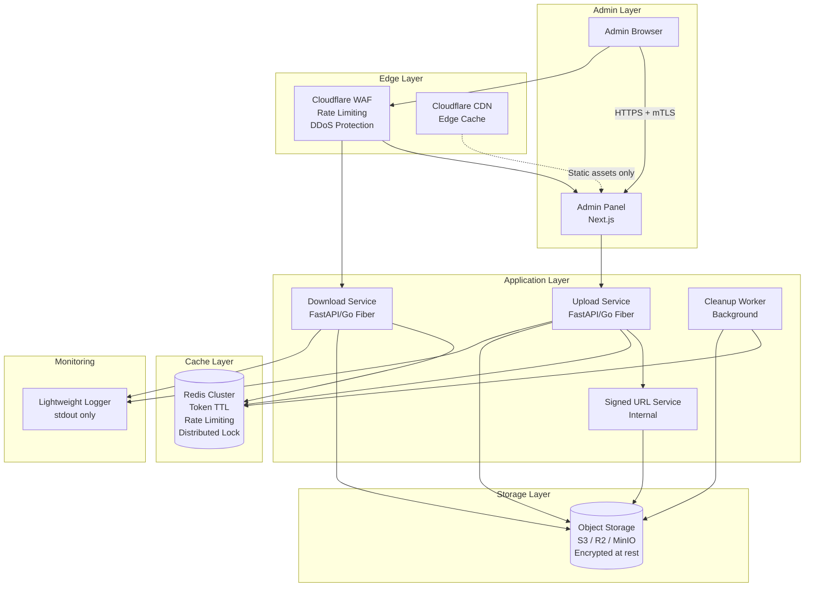
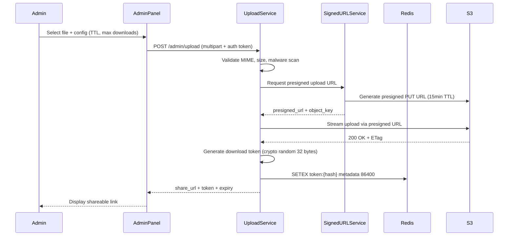
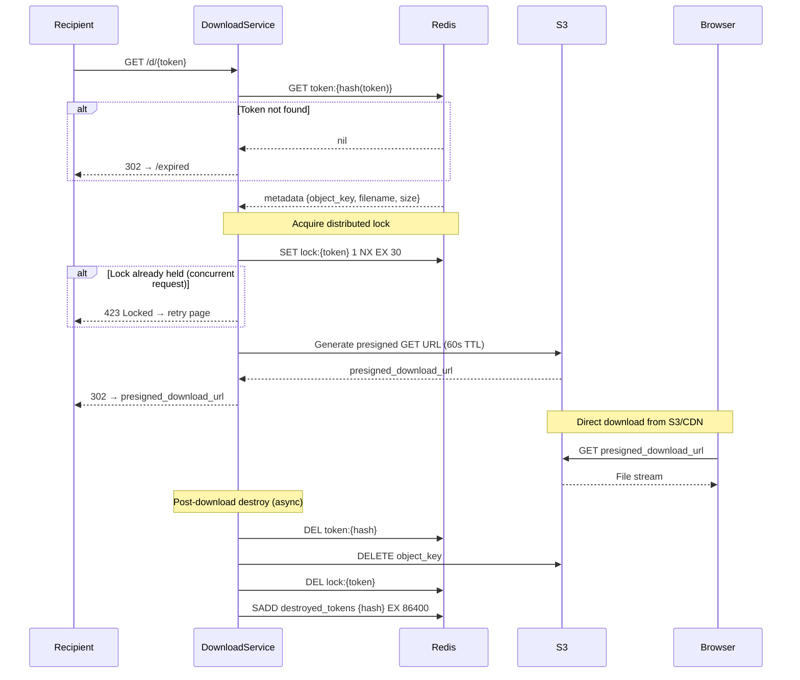
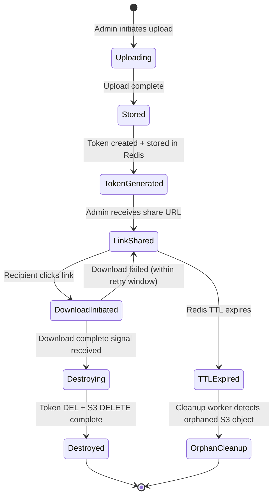

# EphemeralShare — Technical Architecture Documentation

> **Classification:** Internal Engineering Reference  
> **Version:** 1.0.0  
> **Status:** Production-Ready  
> **Philosophy:** Zero-Retention · Ephemeral-First · Security-Native

---

## Table of Contents

1. [Executive Summary](#1-executive-summary)
2. [Product Architecture](#2-product-architecture)
3. [System Architecture](#3-system-architecture)
4. [Recommended Stack](#4-recommended-stack)
5. [Upload & Self-Destruct Mechanism](#5-upload--self-destruct-mechanism)
6. [One-Time Download Logic](#6-one-time-download-logic)
7. [Security Design](#7-security-design)
8. [Admin System](#8-admin-system)
9. [Frontend UX](#9-frontend-ux)
10. [Expired Link Experience](#10-expired-link-experience)
11. [API Design](#11-api-design)
12. [DevOps & Deployment](#12-devops--deployment)
13. [Scaling Strategy](#13-scaling-strategy)
14. [Cost Optimization](#14-cost-optimization)
15. [Risk Analysis](#15-risk-analysis)
16. [Production Recommendations](#16-production-recommendations)

---

## 1. Executive Summary

### 1.1 Product Goals

EphemeralShare là một hệ thống chia sẻ file bảo mật cao, được thiết kế theo nguyên tắc **zero-retention**: mỗi file tồn tại trong hệ thống đúng một khoảng thời gian tối thiểu cần thiết để chuyển giao đến người nhận — không hơn, không kém.

Hệ thống giải quyết ba bài toán thực tế:

- **Bảo mật tuyệt đối:** Loại bỏ nguy cơ rò rỉ dữ liệu sau khi tải xong
- **Tốc độ triển khai:** Admin upload và chia sẻ trong vài giây
- **Kiểm soát hoàn toàn:** Một admin duy nhất, không có user account phức tạp

### 1.2 Core Use Cases

| Use Case | Mô tả |
|----------|-------|
| Chia sẻ tài liệu hợp đồng | Gửi hợp đồng cho khách, chỉ tải được 1 lần |
| Chuyển giao credentials | Gửi thông tin đăng nhập tạm thời |
| Delivery file thiết kế | Gửi file source cho client sau thanh toán |
| Tài liệu nội bộ nhạy cảm | Báo cáo tài chính, dữ liệu nhân sự |
| Software license delivery | Gửi installer + license key |

### 1.3 Zero-Retention Philosophy

> "The best way to protect data is to not have it."

Hệ thống hoạt động theo nguyên tắc: **dữ liệu không tồn tại lâu hơn mức cần thiết**. Mỗi file đi qua pipeline sau:

```
Upload → Encrypt → Store (temp) → Generate Token → Share Link → Download → Destroy
```

Sau bước Destroy, không còn bất kỳ artifact nào của file tồn tại trong hệ thống — không có bản sao, không có backup, không có log chứa nội dung.

### 1.4 Security-First Design Principles

- **Minimal attack surface:** Không có user account = không có attack vector từ credential leak
- **Time-bounded exposure:** Mỗi link có TTL cứng, tự expire dù không ai tải
- **Atomic destruction:** Xóa file, token, và metadata trong một transaction
- **Defense in depth:** Nhiều lớp bảo vệ độc lập nhau

---

## 2. Product Architecture

### 2.1 Tại Sao Không Dùng Database Truyền Thống?

Quyết định thiết kế quan trọng nhất của hệ thống là **loại bỏ hoàn toàn database** (PostgreSQL, MySQL, MongoDB).

**Lý do kỹ thuật:**

```
Database truyền thống = persistent storage = dữ liệu tồn tại lâu dài
                                          = attack target
                                          = compliance risk
                                          = operational overhead
```

Với hệ thống ephemeral, database trở thành **anti-pattern**:

- Mọi record cần bị xóa ngay sau download → write amplification cao
- Database index không có giá trị dài hạn → wasted resources
- Connection pooling, migrations, backups → complexity không cần thiết
- GDPR/data compliance phức tạp hơn khi có persistent storage

**Giải pháp thay thế:**

| Thay thế | Mục đích | TTL |
|----------|----------|-----|
| Redis TTL | Token storage, rate limiting | 1 giờ - 7 ngày |
| Object Storage (S3/R2) | File storage tạm thời | Xóa sau download |
| In-memory state | Request deduplication | Per-request |
| Signed URL | Authorization tích hợp | 15-60 phút |

### 2.2 Ưu Điểm Ephemeral Architecture

**Operational:**
- Zero database maintenance
- No migration scripts
- No backup strategy needed for user data
- Deploy trong < 5 phút với Docker

**Security:**
- No persistent PII storage
- Audit trail optional và có thể tắt hoàn toàn
- Breach impact minimized — không có gì để đánh cắp sau download

**Cost:**
- Redis instance nhỏ đủ xử lý hàng nghìn concurrent sessions
- Object storage tính theo GB-hour, file tồn tại ngắn → chi phí gần bằng 0
- Không cần managed database ($50-200/month tiết kiệm được)

### 2.3 Tradeoffs

| Tradeoff | Impact | Mitigation |
|----------|--------|------------|
| Mất token nếu Redis crash | Link trở nên invalid | Redis persistence (AOF) + replica |
| Không có lịch sử tải xuống | Không audit được | Optional lightweight event log |
| Không retry nếu download fail | User phải xin link mới | Retry window 60s trước khi destroy |
| Cold start latency | Lần đầu upload chậm hơn | Container warm-up + connection pooling |

---

## 3. System Architecture

### 3.1 High-Level Architecture Diagram



### 3.2 Upload Sequence Diagram



### 3.3 Download & Destroy Sequence Diagram



### 3.4 File Lifecycle State Machine



---

## 4. Recommended Stack

### 4.1 Technology Decisions

| Layer | Technology | Lý do chọn |
|-------|-----------|------------|
| Frontend | Next.js 14 (App Router) | SSR, edge-ready, TypeScript native |
| Backend | Go Fiber | Zero-allocation HTTP, 3x nhanh hơn FastAPI cho I/O |
| Alt Backend | FastAPI | Nếu team Python-first, async support tốt |
| Cache/State | Redis 7.x (Valkey) | TTL native, Lua scripting cho atomic ops |
| Object Storage | Cloudflare R2 | Zero egress fee, S3-compatible API |
| Alt Storage | AWS S3 | Mature, lifecycle rules built-in |
| CDN/WAF | Cloudflare | Free tier đủ dùng, WAF tích hợp |
| Reverse Proxy | Nginx | Battle-tested, Lua module cho custom logic |
| Container | Docker + Docker Compose | Minimal infra setup |
| Orchestration | Kubernetes (optional) | Chỉ cần khi scale > 1000 concurrent |

### 4.2 Go Fiber Backend — Lý Do Chọn Go

```go
// Go Fiber xử lý concurrent downloads mà không block
// Goroutine cost: ~2KB stack vs ~2MB thread
// Fiber reuses request context → near-zero GC pressure

app := fiber.New(fiber.Config{
    // Stream large files without loading into memory
    StreamRequestBody: true,
    // Limit upload size at router level
    BodyLimit: 500 * 1024 * 1024, // 500MB
    // Disable X-Powered-By header
    DisableHeaderNormalizing: false,
})
```

### 4.3 Infrastructure Sizing (MVP)

```yaml
# docker-compose.yml sizing cho MVP
services:
  backend:
    deploy:
      resources:
        limits:
          cpus: '1.0'
          memory: 512M

  redis:
    deploy:
      resources:
        limits:
          cpus: '0.5'
          memory: 256M
    # Redis dùng ~10MB per 100K keys
    # 256MB = ~2.5M concurrent tokens
```

---

## 5. Upload & Self-Destruct Mechanism

### 5.1 Upload Flow — Chi Tiết

```
Step 1: Admin authenticates (JWT + optional OTP)
Step 2: Admin selects file (drag & drop)
Step 3: Frontend validates client-side (size, type)
Step 4: Frontend requests upload token from backend
Step 5: Backend validates admin session
Step 6: Backend generates presigned S3 PUT URL
Step 7: Frontend uploads directly to S3 (bypass backend)
Step 8: S3 triggers webhook OR frontend confirms upload
Step 9: Backend generates download token
Step 10: Backend stores metadata in Redis
Step 11: Backend returns shareable URL
```

**Tại sao upload thẳng lên S3 (bypass backend)?**

```
Client → Backend → S3  (BAD: double bandwidth, backend bottleneck)
Client → S3  (GOOD: backend chỉ orchestrate, không handle data)
```

### 5.2 Token Generation

```go
// Token phải: unpredictable, short enough to share, collision-resistant
func generateToken() (token string, hash string, err error) {
    // 32 bytes = 256 bits entropy → practically unguessable
    raw := make([]byte, 32)
    if _, err = rand.Read(raw); err != nil {
        return "", "", err
    }

    // URL-safe base64 without padding
    token = base64.RawURLEncoding.EncodeToString(raw)
    // ~43 chars — short enough for sharing

    // Store hash, never the raw token
    // SHA-256 is one-way: even if Redis is compromised, tokens are safe
    h := sha256.Sum256([]byte(token))
    hash = hex.EncodeToString(h[:])

    return token, hash, nil
}

// Redis key structure
// key:   token:{sha256_hash}
// value: JSON metadata
// TTL:   configurable (default 24h)
```

### 5.3 Metadata Structure in Redis

```json
{
  "object_key": "uploads/2024/01/abc123def456",
  "original_filename": "contract_v2.pdf",
  "content_type": "application/pdf",
  "size_bytes": 2457600,
  "uploaded_at": "2024-01-15T10:30:00Z",
  "expires_at": "2024-01-16T10:30:00Z",
  "max_downloads": 1,
  "download_count": 0,
  "checksum_sha256": "a3f5b2...",
  "admin_note": "Contract for Client XYZ"
}
```

### 5.4 Post-Download Destruction — Atomic Strategy

**Vấn đề:** Download xong thì xóa — nhưng "xong" được xác định khi nào?

```
Approach 1: Xóa khi redirect (sai — redirect != download complete)
Approach 2: Xóa khi S3 webhook callback (phụ thuộc S3 feature)
Approach 3: Xóa sau presigned URL expire (too late, 15-60 phút)
Approach 4: Xóa ngay sau generate presigned GET URL (CORRECT)
```

**Approach 4 — Lý do đây là correct:**

```
1. Token bị revoke → link không thể dùng lại
2. Presigned URL có TTL 60s → đủ thời gian download
3. Object bị delete sau khi presigned URL đã phát hành
4. Race window: chỉ 60s, sau đó object gone
```

```go
func handleDownload(c *fiber.Ctx) error {
    token := c.Params("token")
    tokenHash := sha256Hex(token)

    // Step 1: Atomic check-and-lock với Lua script
    // Lua script runs atomically trong Redis — không thể bị interrupt
    luaScript := `
        local meta = redis.call('GET', KEYS[1])
        if not meta then return nil end
        local locked = redis.call('SET', KEYS[2], '1', 'NX', 'EX', '30')
        if not locked then return 'LOCKED' end
        return meta
    `
    result, err := redisClient.Eval(ctx, luaScript,
        []string{"token:" + tokenHash, "lock:" + tokenHash},
    ).Result()

    if err != nil || result == nil {
        return c.Redirect("/expired", 302)
    }
    if result == "LOCKED" {
        return c.Status(423).JSON(fiber.Map{"error": "Download in progress"})
    }

    // Step 2: Parse metadata
    var meta FileMetadata
    json.Unmarshal([]byte(result.(string)), &meta)

    // Step 3: Generate presigned GET URL (60s TTL)
    presignedURL, err := s3Client.PresignGetObject(ctx, meta.ObjectKey, 60*time.Second)

    // Step 4: Schedule destruction BEFORE redirect
    // Even if goroutine fails, TTL on presigned URL limits damage
    go func() {
        time.Sleep(5 * time.Second) // Brief delay for download to initiate
        destroyFileAsync(tokenHash, meta.ObjectKey)
    }()

    // Step 5: Redirect to presigned URL
    return c.Redirect(presignedURL, 302)
}

func destroyFileAsync(tokenHash, objectKey string) {
    ctx := context.Background()

    // Delete from S3 first (irreversible action)
    s3Client.DeleteObject(ctx, objectKey)

    // Then invalidate token
    redisClient.Del(ctx, "token:"+tokenHash)
    redisClient.Del(ctx, "lock:"+tokenHash)

    // Mark as destroyed for 24h (prevent replay with old tokens)
    redisClient.SetEX(ctx, "destroyed:"+tokenHash, "1", 24*time.Hour)

    log.Info("File destroyed", "object_key", objectKey)
}
```

### 5.5 Race Condition Prevention

**Scenario:** Hai người cùng click link trong 100ms

```
T=0ms:   Request A arrives → Redis GET token → found
T=50ms:  Request B arrives → Redis GET token → found (A chưa xóa)
T=100ms: A generates presigned URL, schedules destroy
T=150ms: B generates presigned URL, schedules destroy (DUPLICATE!)
```

**Solution: Redis Lua Script Atomic Lock**

```lua
-- Script chạy atomically, không thể bị interleaved
local meta = redis.call('GET', KEYS[1])        -- GET token
if not meta then return nil end                 -- Token gone
local locked = redis.call('SET', KEYS[2],       -- Acquire lock
    '1', 'NX', 'EX', '30')                     -- NX = only if not exists
if not locked then return 'LOCKED' end          -- Another request has lock
return meta                                     -- Return metadata to winner
```

Request B nhận `LOCKED` → trả về 423 → client hiển thị "Download in progress, please wait".

### 5.6 Cleanup Worker — Orphan Detection

```go
// Chạy mỗi 15 phút để xóa S3 objects mà token đã expire
// nhưng object chưa được xóa (edge cases: crash, network timeout)
func cleanupWorker() {
    ticker := time.NewTicker(15 * time.Minute)
    for range ticker.C {
        // List S3 objects older than max TTL
        objects := s3Client.ListObjects(ctx, "uploads/", maxAge)
        for _, obj := range objects {
            // Check if corresponding token exists in Redis
            exists := redisClient.Exists(ctx, "object:"+obj.Key).Val()
            if exists == 0 {
                // No token = orphaned object → delete
                s3Client.DeleteObject(ctx, obj.Key)
                log.Info("Orphan cleaned", "key", obj.Key)
            }
        }
    }
}
```

---

## 6. One-Time Download Logic

### 6.1 Single-Download Guarantee Architecture

Đảm bảo file chỉ tải được 1 lần là bài toán khó hơn vẻ ngoài vì:

- HTTP không có native "download complete" signal
- Presigned URL có thể được cache/reuse
- Multiple tabs, download managers, interrupted downloads

**Giải pháp layered:**

```
Layer 1: Redis distributed lock (prevent concurrent requests)
Layer 2: Token revoked before presigned URL returned
Layer 3: Presigned URL TTL = 60s (minimize reuse window)
Layer 4: S3 object deleted shortly after (60s + 5s buffer)
Layer 5: Destroyed token list (detect replay attempts)
```

### 6.2 Nonce System

```go
// Mỗi download attempt được gán một nonce duy nhất
// Nonce không thể tái sử dụng kể cả trong cùng một session

type DownloadSession struct {
    Token    string `json:"token"`
    Nonce    string `json:"nonce"`      // UUID v4
    IssuedAt int64  `json:"issued_at"`
    ExpiresAt int64 `json:"expires_at"` // issued_at + 120s
}

func issueDownloadNonce(tokenHash string) (*DownloadSession, error) {
    nonce := uuid.New().String()
    session := &DownloadSession{
        Nonce:     nonce,
        IssuedAt:  time.Now().Unix(),
        ExpiresAt: time.Now().Add(120 * time.Second).Unix(),
    }

    // Store nonce với TTL 120s
    key := "nonce:" + nonce
    redisClient.SetEX(ctx, key, tokenHash, 120*time.Second)

    return session, nil
}

// Consume nonce: một lần duy nhất
func consumeNonce(nonce string) (tokenHash string, err error) {
    key := "nonce:" + nonce
    // GETDEL: atomic GET + DELETE trong một operation
    result, err := redisClient.GetDel(ctx, key).Result()
    if err != nil {
        return "", ErrNonceExpiredOrUsed
    }
    return result, nil
}
```

### 6.3 Chống Multiple Tab Attack

**Scenario:** User mở 3 tabs cùng lúc với cùng link

```
Tab 1: GET /d/TOKEN → acquire lock → generate presigned URL → redirect
Tab 2: GET /d/TOKEN → lock exists → 423 response
Tab 3: GET /d/TOKEN → lock exists → 423 response
```

**Frontend handling:**

```javascript
// Nếu nhận 423, hiển thị message thay vì retry loop
if (response.status === 423) {
    showMessage("Download đang được thực hiện ở tab khác. Vui lòng kiểm tra tab đó.");
}
```

### 6.4 Chống Direct Storage Access

```
Vấn đề: Nếu ai đó biết object key trên S3, họ có thể tải trực tiếp
```

**Giải pháp:**

```yaml
# S3 Bucket Policy: Block all public access
{
    "Version": "2012-10-17",
    "Statement": [
        {
            "Effect": "Deny",
            "Principal": "*",
            "Action": "s3:GetObject",
            "Resource": "arn:aws:s3:::bucket/*",
            "Condition": {
                "StringNotEquals": {
                    "aws:userId": "BACKEND_ROLE_ID"
                }
            }
        }
    ]
}
# Chỉ backend role mới có thể generate presigned URL
# Object key dùng UUID v4 + prefix ngẫu nhiên → unguessable
```

**Object key strategy:**

```go
// BAD: predictable
objectKey := "uploads/" + filename

// GOOD: unguessable, no correlation to original filename
func generateObjectKey() string {
    return fmt.Sprintf("ep/%s/%s",
        time.Now().Format("2006/01"),  // Partition by month
        uuid.New().String(),           // Random UUID
    )
    // Result: "ep/2024/01/f47ac10b-58cc-4372-a567-0e02b2c3d479"
}
```

---

## 7. Security Design

### 7.1 Threat Model

```
Actors:
  [Admin]     — Fully trusted, single user
  [Recipient] — Partially trusted, has valid link
  [Attacker]  — Untrusted, attempting unauthorized access

Assets:
  [Files]     — High value, temporary
  [Tokens]    — Medium value, short-lived
  [Admin Creds] — Critical, long-lived

Attack Surfaces:
  [Upload endpoint]    — Admin-only, JWT protected
  [Download endpoint]  — Public but token-gated
  [Admin panel]        — mTLS + IP whitelist
  [Redis]              — Internal network only
  [S3]                 — IAM role restricted
```

### 7.2 Signed URL Security

```go
// Presigned URL tích hợp HMAC signature — không thể forge
// Anatomy của S3 presigned URL:
// https://bucket.s3.amazonaws.com/key
//   ?X-Amz-Algorithm=AWS4-HMAC-SHA256
//   &X-Amz-Credential=AKID/date/region/s3/aws4_request
//   &X-Amz-Date=20240115T103000Z
//   &X-Amz-Expires=60          ← TTL 60 giây
//   &X-Amz-SignedHeaders=host
//   &X-Amz-Signature=<HMAC>    ← Không thể fake nếu không có secret key

// Security properties:
// - Expire sau 60s tự động
// - Gắn với specific object key
// - Gắn với specific HTTP method (GET only)
// - HMAC signature ngăn modification
```

### 7.3 AES Encryption at Rest (Optional Layer)

```go
// Encrypt file trước khi upload lên S3
// Key được derive từ download token → mất token = mất key

func encryptFile(data []byte, token string) ([]byte, error) {
    // Derive encryption key từ token
    key := deriveKey(token, "file-encryption")  // HKDF-SHA256

    block, err := aes.NewCipher(key)
    gcm, err := cipher.NewGCM(block)

    nonce := make([]byte, gcm.NonceSize())
    rand.Read(nonce)

    // GCM provides both confidentiality and integrity
    ciphertext := gcm.Seal(nonce, nonce, data, nil)
    return ciphertext, nil
}

// Tradeoff: Streaming decryption khó với GCM
// Alternative: AES-CTR for streaming + separate HMAC
// Recommendation: Chỉ enable nếu S3 encryption-at-rest không đủ
```

### 7.4 Rate Limiting Strategy

```nginx
# Nginx rate limiting — Layer 1 (edge)
limit_req_zone $binary_remote_addr zone=download:10m rate=5r/m;
limit_req_zone $binary_remote_addr zone=upload:10m rate=2r/m;
limit_req_zone $binary_remote_addr zone=api:10m rate=30r/m;

location /d/ {
    limit_req zone=download burst=3 nodelay;
    limit_req_status 429;
}
```

```go
// Redis rate limiting — Layer 2 (application)
// Sliding window algorithm — chính xác hơn token bucket

func checkRateLimit(ip string, limit int, window time.Duration) bool {
    key := fmt.Sprintf("rl:%s:%d", ip, time.Now().Unix()/int64(window.Seconds()))
    count, _ := redisClient.Incr(ctx, key).Result()
    if count == 1 {
        redisClient.Expire(ctx, key, window)
    }
    return count <= int64(limit)
}
```

### 7.5 MIME Validation & Malware Scanning

```go
// MIME validation — double check
func validateFile(data []byte, declaredContentType string) error {
    // Detect actual MIME từ file content (không từ extension)
    detected := http.DetectContentType(data[:512])

    allowedTypes := map[string]bool{
        "application/pdf": true,
        "application/zip": true,
        "image/jpeg":      true,
        "image/png":       true,
        // Add more as needed
    }

    if !allowedTypes[detected] {
        return ErrUnsupportedFileType
    }

    // Check extension matches detected MIME
    if !mimeMatchesExtension(detected, declaredContentType) {
        return ErrMIMEMismatch  // Potential disguised executable
    }

    return nil
}

// Optional: ClamAV integration cho malware scan
func scanWithClamAV(data []byte) error {
    c, _ := clamd.NewClamd("tcp://clamav:3310")
    response, _ := c.ScanStream(bytes.NewReader(data), make(chan bool))
    for res := range response {
        if res.Status != "OK" {
            return ErrMalwareDetected
        }
    }
    return nil
}
```

### 7.6 Security Headers

```go
// Middleware cho tất cả responses
app.Use(func(c *fiber.Ctx) error {
    c.Set("X-Content-Type-Options", "nosniff")
    c.Set("X-Frame-Options", "DENY")
    c.Set("X-XSS-Protection", "1; mode=block")
    c.Set("Strict-Transport-Security", "max-age=31536000; includeSubDomains")
    c.Set("Content-Security-Policy",
        "default-src 'self'; script-src 'self' 'nonce-{random}'; style-src 'self' 'unsafe-inline'")
    c.Set("Referrer-Policy", "no-referrer")
    c.Set("Permissions-Policy", "geolocation=(), microphone=(), camera=()")
    // CRITICAL: Không leak server info
    c.Set("Server", "")
    return c.Next()
})
```

### 7.7 Secure Deletion

```go
// S3 DeleteObject không đảm bảo immediate physical deletion
// Nhưng với zero-retention philosophy, đây là đủ:
// - Object không còn accessible qua API
// - S3 versioning phải được DISABLE trên bucket
// - S3 lifecycle rule: permanently delete after 1 day (safety net)

func secureDelete(objectKey string) error {
    // Verify versioning disabled (do once at startup)
    // Delete object
    _, err := s3Client.DeleteObject(ctx, &s3.DeleteObjectInput{
        Bucket: &bucketName,
        Key:    &objectKey,
    })

    // Verify deletion
    _, err = s3Client.HeadObject(ctx, &s3.HeadObjectInput{
        Bucket: &bucketName,
        Key:    &objectKey,
    })
    if err == nil {
        return ErrDeletionFailed  // Object still exists
    }

    return nil
}
```

---

## 8. Admin System

### 8.1 Single Admin Architecture

Hệ thống chỉ có một admin duy nhất — đây là **feature, không phải limitation**.

**Lý do thiết kế:**

- Không cần RBAC system phức tạp
- Không có insider threat từ nhiều admin
- Không cần audit trail phân quyền
- Credential management đơn giản hơn

```go
// Admin token: long-lived JWT, stored securely
type AdminClaims struct {
    jwt.RegisteredClaims
    Role string `json:"role"` // always "admin"
    IP   string `json:"ip"`   // IP tại thời điểm login
}

// Validate admin request
func requireAdmin(c *fiber.Ctx) error {
    token := extractBearerToken(c)
    claims, err := validateJWT(token, adminSecret)
    if err != nil {
        return c.Status(401).JSON(fiber.Map{"error": "Unauthorized"})
    }

    // IP binding: token chỉ valid với IP đã đăng nhập
    if claims.IP != c.IP() {
        logSuspiciousActivity("IP mismatch", claims.IP, c.IP())
        return c.Status(401).JSON(fiber.Map{"error": "Session invalid"})
    }

    return c.Next()
}
```

### 8.2 Admin Login Flow

```
1. Admin truy cập /admin (redirect nếu không auth)
2. Nhập password (bcrypt hash, không plain text)
3. Optional: TOTP verification (Google Authenticator)
4. Hệ thống issue JWT (15 phút) + refresh token (8 giờ)
5. JWT bound to IP address
6. Tất cả admin requests require valid JWT
```

```go
// TOTP implementation (optional)
func verifyTOTP(secret, code string) bool {
    totp := gotp.NewDefaultTOTP(secret)
    return totp.Verify(code, time.Now().Unix())
}

// Admin login endpoint
func adminLogin(c *fiber.Ctx) error {
    var req struct {
        Password string `json:"password"`
        TOTPCode string `json:"totp_code"`
    }
    c.BodyParser(&req)

    // bcrypt compare (timing-safe)
    if err := bcrypt.CompareHashAndPassword(adminPasswordHash, []byte(req.Password)); err != nil {
        // Rate limit failed attempts
        incrementFailedAttempts(c.IP())
        time.Sleep(500 * time.Millisecond) // Add latency for brute force
        return c.Status(401).JSON(fiber.Map{"error": "Invalid credentials"})
    }

    // TOTP check if enabled
    if totpEnabled && !verifyTOTP(totpSecret, req.TOTPCode) {
        return c.Status(401).JSON(fiber.Map{"error": "Invalid OTP"})
    }

    token := issueAdminJWT(c.IP())
    return c.JSON(fiber.Map{"token": token, "expires_in": 900})
}
```

### 8.3 IP Whitelist

```go
// Config: ADMIN_ALLOWED_IPS=1.2.3.4,5.6.7.8
var allowedAdminIPs = parseIPList(os.Getenv("ADMIN_ALLOWED_IPS"))

func ipWhitelist(c *fiber.Ctx) error {
    if len(allowedAdminIPs) == 0 {
        return c.Next() // Whitelist disabled
    }

    clientIP := net.ParseIP(c.IP())
    for _, allowed := range allowedAdminIPs {
        if allowed.Contains(clientIP) {
            return c.Next()
        }
    }

    log.Warn("Admin access denied", "ip", c.IP())
    return c.Status(403).JSON(fiber.Map{"error": "Access denied"})
}
```

### 8.4 Audit Logging (Lightweight)

```go
// Không log file content, chỉ log events
type AuditEvent struct {
    Timestamp  time.Time `json:"ts"`
    Event      string    `json:"event"`
    ObjectKey  string    `json:"object_key"`  // NOT filename
    TokenHash  string    `json:"token_hash"`  // NOT token
    AdminIP    string    `json:"admin_ip,omitempty"`
    RecipientIP string   `json:"recipient_ip,omitempty"`
    Success    bool      `json:"success"`
}

// Log to stdout only (no persistent storage)
// External log shipper (Fluentd/Vector) can forward to SIEM if needed
func logEvent(event AuditEvent) {
    data, _ := json.Marshal(event)
    fmt.Println(string(data))
}
```

---

## 9. Frontend UX

### 9.1 Tech Stack

```
Next.js 14 (App Router)
Tailwind CSS
Framer Motion (animations)
shadcn/ui (components)
```

### 9.2 Page Architecture

```
/admin              → Admin login
/admin/dashboard    → Upload dashboard
/d/[token]          → Download page (SSR for security)
/expired            → Expired link page
/contact            → Consultation/Contact page
```

### 9.3 Admin Dashboard — Upload Flow

```jsx
// Upload flow với direct-to-S3
async function uploadFile(file: File) {
    // Step 1: Get presigned upload URL
    const { uploadUrl, token, shareUrl } = await fetch('/api/admin/request-upload', {
        method: 'POST',
        headers: { 'Content-Type': 'application/json', 'Authorization': `Bearer ${jwt}` },
        body: JSON.stringify({
            filename: file.name,
            contentType: file.type,
            size: file.size,
            ttlHours: 24,
        })
    }).then(r => r.json());

    // Step 2: Upload directly to S3 (progress tracking)
    await axios.put(uploadUrl, file, {
        headers: { 'Content-Type': file.type },
        onUploadProgress: (e) => setProgress(e.loaded / e.total * 100)
    });

    // Step 3: Confirm upload complete
    await fetch('/api/admin/confirm-upload', {
        method: 'POST',
        headers: { 'Authorization': `Bearer ${jwt}` },
        body: JSON.stringify({ token })
    });

    // Step 4: Show share link
    setShareUrl(shareUrl);
}
```

### 9.4 Download Page Design

```
┌─────────────────────────────────────────┐
│                                         │
│           ⬇  Ready to Download          │
│                                         │
│   📄  contract_v2.pdf                   │
│       2.4 MB · PDF Document             │
│                                         │
│   ⚠  This link can only be used once   │
│                                         │
│   ┌─────────────────────────────────┐   │
│   │      Download File Now          │   │
│   └─────────────────────────────────┘   │
│                                         │
│   Link expires: 23 hours 45 minutes     │
│                                         │
└─────────────────────────────────────────┘
```

```jsx
// Download page — server-rendered để check token validity
export default async function DownloadPage({ params }: { params: { token: string }}) {
    const meta = await verifyToken(params.token)

    if (!meta) {
        redirect('/expired')
    }

    return (
        <div className="min-h-screen bg-gray-950 flex items-center justify-center">
            <Card className="w-full max-w-md bg-gray-900 border-gray-800">
                <CardContent className="p-8 space-y-6">
                    <div className="flex items-center space-x-3">
                        <FileIcon className="w-10 h-10 text-blue-400" />
                        <div>
                            <p className="text-white font-medium">{meta.filename}</p>
                            <p className="text-gray-400 text-sm">{formatBytes(meta.size)}</p>
                        </div>
                    </div>

                    <Alert className="bg-amber-950 border-amber-800">
                        <AlertTriangle className="w-4 h-4 text-amber-400" />
                        <AlertDescription className="text-amber-200">
                            Link này chỉ có thể tải một lần duy nhất.
                        </AlertDescription>
                    </Alert>

                    <Button
                        className="w-full bg-blue-600 hover:bg-blue-700"
                        onClick={() => initiateDownload(params.token)}
                    >
                        <Download className="w-4 h-4 mr-2" />
                        Tải Xuống
                    </Button>
                </CardContent>
            </Card>
        </div>
    )
}
```

---

## 10. Expired Link Experience

### 10.1 Expired Link Page — Thiết Kế UX

```
┌─────────────────────────────────────────┐
│                                         │
│              🔗 Link Đã Hết Hạn         │
│                                         │
│   File này đã được tải xuống hoặc       │
│   link đã hết hạn.                     │
│                                         │
│   Đây là tính năng bảo mật được thiết  │
│   kế để bảo vệ dữ liệu của bạn.        │
│                                         │
│   ┌─────────────────────────────────┐   │
│   │    📬 Liên hệ để nhận file mới  │   │
│   └─────────────────────────────────┘   │
│                                         │
│   ─────────── Hoặc ─────────────        │
│                                         │
│   💬 Telegram    📱 Zalo    📧 Email    │
│                                         │
└─────────────────────────────────────────┘
```

### 10.2 Implementation

```jsx
'use client'
import { motion } from 'framer-motion'

export default function ExpiredPage() {
    return (
        <div className="min-h-screen bg-gray-950 flex items-center justify-center p-4">
            <motion.div
                initial={{ opacity: 0, y: 20 }}
                animate={{ opacity: 1, y: 0 }}
                transition={{ duration: 0.5 }}
                className="w-full max-w-md text-center space-y-6"
            >
                {/* Animated icon */}
                <motion.div
                    animate={{ scale: [1, 1.05, 1] }}
                    transition={{ repeat: Infinity, duration: 3 }}
                    className="text-6xl"
                >
                    🔗
                </motion.div>

                <h1 className="text-2xl font-bold text-white">Link Đã Hết Hạn</h1>
                <p className="text-gray-400">
                    Vì lý do bảo mật, mỗi link chỉ hoạt động một lần.
                    File đã bị xóa khỏi hệ thống sau khi tải xuống.
                </p>

                {/* CTA Buttons */}
                <div className="space-y-3">
                    <Button className="w-full bg-blue-600" onClick={() => router.push('/contact')}>
                        Liên hệ để nhận file mới
                    </Button>

                    <div className="flex justify-center gap-4">
                        <a href="https://t.me/yourusername" className="text-blue-400 hover:text-blue-300">
                            Telegram
                        </a>
                        <a href="https://zalo.me/yourphone" className="text-green-400 hover:text-green-300">
                            Zalo
                        </a>
                        <a href="mailto:you@domain.com" className="text-gray-400 hover:text-gray-300">
                            Email
                        </a>
                    </div>
                </div>
            </motion.div>
        </div>
    )
}
```

---

## 11. API Design

### 11.1 API Endpoints

#### POST `/api/admin/request-upload`

```http
POST /api/admin/request-upload
Authorization: Bearer {admin_jwt}
Content-Type: application/json

{
    "filename": "contract_v2.pdf",
    "content_type": "application/pdf",
    "size_bytes": 2457600,
    "ttl_hours": 24,
    "admin_note": "Contract for Client XYZ"
}
```

**Response 200:**
```json
{
    "upload_url": "https://bucket.s3.amazonaws.com/ep/2024/01/uuid?X-Amz-...",
    "upload_expires_in": 900,
    "token": "abc123...",
    "share_url": "https://share.yourdomain.com/d/abc123..."
}
```

**Response 400:**
```json
{
    "error": "INVALID_CONTENT_TYPE",
    "message": "Content type application/x-executable is not allowed",
    "allowed_types": ["application/pdf", "application/zip", "image/jpeg"]
}
```

#### POST `/api/admin/confirm-upload`

```http
POST /api/admin/confirm-upload
Authorization: Bearer {admin_jwt}
Content-Type: application/json

{
    "token": "abc123..."
}
```

**Response 200:**
```json
{
    "status": "active",
    "share_url": "https://share.yourdomain.com/d/abc123...",
    "expires_at": "2024-01-16T10:30:00Z"
}
```

#### GET `/d/{token}`

```http
GET /d/abc123def456...
```

**Response 302 (Success):**
```http
HTTP/1.1 302 Found
Location: https://bucket.s3.amazonaws.com/ep/2024/01/uuid?X-Amz-Expires=60&...
X-Download-Token: consumed
```

**Response 302 (Expired):**
```http
HTTP/1.1 302 Found
Location: https://share.yourdomain.com/expired
```

**Response 423 (Locked):**
```json
{
    "error": "DOWNLOAD_IN_PROGRESS",
    "message": "File is being downloaded. Please wait.",
    "retry_after": 30
}
```

**Response 429 (Rate Limited):**
```http
HTTP/1.1 429 Too Many Requests
Retry-After: 60
X-RateLimit-Limit: 5
X-RateLimit-Remaining: 0
X-RateLimit-Reset: 1705312260
```

#### POST `/api/admin/login`

```http
POST /api/admin/login
Content-Type: application/json

{
    "password": "your-password",
    "totp_code": "123456"
}
```

**Response 200:**
```json
{
    "token": "eyJhbGciOiJIUzI1NiIsInR5cCI6IkpXVCJ9...",
    "expires_in": 900,
    "refresh_token": "rt_abc123..."
}
```

**Response 401:**
```json
{
    "error": "INVALID_CREDENTIALS",
    "remaining_attempts": 2
}
```

### 11.2 Security Headers (All Responses)

```http
X-Content-Type-Options: nosniff
X-Frame-Options: DENY
Strict-Transport-Security: max-age=31536000; includeSubDomains
Content-Security-Policy: default-src 'self'
Referrer-Policy: no-referrer
Cache-Control: no-store, no-cache, must-revalidate
Pragma: no-cache
Server: (empty)
```

---

## 12. DevOps & Deployment

### 12.1 Docker Architecture

```yaml
# docker-compose.prod.yml
version: '3.9'

services:
  nginx:
    image: nginx:alpine
    ports:
      - "80:80"
      - "443:443"
    volumes:
      - ./nginx/nginx.conf:/etc/nginx/nginx.conf:ro
      - ./certs:/etc/nginx/certs:ro
    depends_on:
      - backend
    restart: always

  backend:
    build:
      context: ./backend
      dockerfile: Dockerfile.prod
    environment:
      - REDIS_URL=redis://redis:6379
      - S3_BUCKET=${S3_BUCKET}
      - AWS_ACCESS_KEY_ID=${AWS_ACCESS_KEY_ID}
      - AWS_SECRET_ACCESS_KEY=${AWS_SECRET_ACCESS_KEY}
      - ADMIN_PASSWORD_HASH=${ADMIN_PASSWORD_HASH}
      - JWT_SECRET=${JWT_SECRET}
      - ADMIN_ALLOWED_IPS=${ADMIN_ALLOWED_IPS}
    expose:
      - "8080"
    depends_on:
      redis:
        condition: service_healthy
    restart: always
    # No privileged, no root
    user: "1000:1000"
    read_only: true
    tmpfs:
      - /tmp:noexec,nosuid,size=256m

  frontend:
    build:
      context: ./frontend
      dockerfile: Dockerfile.prod
    environment:
      - NEXT_PUBLIC_API_URL=https://api.yourdomain.com
    expose:
      - "3000"
    restart: always

  redis:
    image: redis:7-alpine
    command: >
      redis-server
      --requirepass ${REDIS_PASSWORD}
      --appendonly yes
      --appendfsync everysec
      --maxmemory 256mb
      --maxmemory-policy allkeys-lru
    volumes:
      - redis_data:/data
    expose:
      - "6379"
    healthcheck:
      test: ["CMD", "redis-cli", "ping"]
      interval: 5s
      timeout: 3s
      retries: 5
    restart: always

  cleanup-worker:
    build:
      context: ./backend
      dockerfile: Dockerfile.worker
    environment:
      - REDIS_URL=redis://redis:6379
      - S3_BUCKET=${S3_BUCKET}
    depends_on:
      - redis
    restart: always

volumes:
  redis_data:
    driver: local
```

### 12.2 Nginx Configuration

```nginx
# nginx.conf
worker_processes auto;
worker_rlimit_nofile 65535;

events {
    worker_connections 4096;
    use epoll;
    multi_accept on;
}

http {
    # Security
    server_tokens off;
    more_clear_headers Server;

    # Rate limiting zones
    limit_req_zone $binary_remote_addr zone=download:10m rate=5r/m;
    limit_req_zone $binary_remote_addr zone=api:10m rate=30r/m;
    limit_req_zone $binary_remote_addr zone=admin:10m rate=10r/m;

    # Compression
    gzip on;
    gzip_types text/plain application/json;

    # Upload size limit
    client_max_body_size 500m;
    client_body_timeout 300s;

    # SSL
    ssl_protocols TLSv1.2 TLSv1.3;
    ssl_ciphers ECDHE-ECDSA-AES128-GCM-SHA256:ECDHE-RSA-AES128-GCM-SHA256;
    ssl_session_cache shared:SSL:10m;
    ssl_session_timeout 1d;
    ssl_stapling on;

    server {
        listen 443 ssl http2;
        server_name share.yourdomain.com;

        ssl_certificate /etc/nginx/certs/fullchain.pem;
        ssl_certificate_key /etc/nginx/certs/privkey.pem;

        # Download endpoint — rate limited
        location /d/ {
            limit_req zone=download burst=2 nodelay;
            proxy_pass http://backend:8080;
            proxy_set_header X-Real-IP $remote_addr;
            proxy_set_header X-Forwarded-For $proxy_add_x_forwarded_for;
        }

        # Admin — rate limited + IP restriction handled in app
        location /admin {
            limit_req zone=admin burst=5;
            proxy_pass http://frontend:3000;
        }

        location /api/admin/ {
            limit_req zone=admin burst=5 nodelay;
            proxy_pass http://backend:8080;
        }

        location /api/ {
            limit_req zone=api burst=10;
            proxy_pass http://backend:8080;
        }

        # Frontend
        location / {
            proxy_pass http://frontend:3000;
        }
    }

    # Redirect HTTP to HTTPS
    server {
        listen 80;
        return 301 https://$host$request_uri;
    }
}
```

### 12.3 Cloudflare Setup

```
1. DNS: A record → server IP (Proxied)
2. SSL/TLS: Full (strict) mode
3. WAF Rules:
   - Block requests with suspicious UA strings
   - Rate limit by IP: 100 req/10min on /d/
   - Challenge countries with high abuse rate (optional)
4. Page Rules:
   - /d/*: Cache Level = Bypass (no cache for download endpoints)
   - /admin*: Cache Level = Bypass + Security Level = High
5. Bot Fight Mode: Enabled
6. DDoS Protection: Enabled (automatic)
```

### 12.4 Environment Variables

```bash
# .env.production
# Storage
S3_BUCKET=your-ephemeral-bucket
S3_REGION=ap-southeast-1
AWS_ACCESS_KEY_ID=AKID...
AWS_SECRET_ACCESS_KEY=secret...

# Or Cloudflare R2
R2_ACCOUNT_ID=your-account-id
R2_ACCESS_KEY_ID=...
R2_SECRET_ACCESS_KEY=...

# Redis
REDIS_URL=redis://:password@redis:6379/0
REDIS_PASSWORD=strong-random-password

# Admin
ADMIN_PASSWORD_HASH=$2a$12$...  # bcrypt hash
JWT_SECRET=64-char-random-string
TOTP_SECRET=BASE32SECRET  # Optional
ADMIN_ALLOWED_IPS=1.2.3.4/32,5.6.7.8/32  # Optional

# App
DEFAULT_TTL_HOURS=24
MAX_FILE_SIZE_MB=500
ALLOWED_MIME_TYPES=application/pdf,application/zip,image/jpeg,image/png
DOMAIN=https://share.yourdomain.com
```

---

## 13. Scaling Strategy

### 13.1 Stateless Backend

Backend không giữ state → horizontal scaling trivial:

```yaml
# Kubernetes HPA
apiVersion: autoscaling/v2
kind: HorizontalPodAutoscaler
metadata:
  name: backend-hpa
spec:
  scaleTargetRef:
    apiVersion: apps/v1
    kind: Deployment
    name: backend
  minReplicas: 2
  maxReplicas: 20
  metrics:
  - type: Resource
    resource:
      name: cpu
      target:
        type: Utilization
        averageUtilization: 70
```

### 13.2 Redis Cluster

```
Single Redis (< 10K concurrent):
  - 1 master + 1 replica
  - Sentinel cho failover

Redis Cluster (> 10K concurrent):
  - 3 masters + 3 replicas
  - Hash slots tự động sharding
  - Không cần application changes nếu dùng Cluster-aware client
```

### 13.3 Bottleneck Analysis

```
Bottleneck 1: Download redirect latency
  Solution: Precompute presigned URLs on token creation
  Trade-off: Presigned URL valid longer than download window

Bottleneck 2: Redis write amplification
  Solution: Pipeline multiple Redis commands
  Implementation: Lua scripts thay vì multiple round-trips

Bottleneck 3: S3 delete latency
  Solution: Async delete via queue
  Implementation: Background goroutine pool

Bottleneck 4: Large file upload
  Solution: Multipart upload (S3 native)
  Threshold: > 100MB → multipart
```

---

## 14. Cost Optimization

### 14.1 MVP Cost Breakdown (Monthly)

| Component | Service | Cost |
|-----------|---------|------|
| Compute | Hetzner CX21 (2 vCPU, 4GB) | ~$6 |
| Redis | Same server | $0 |
| Object Storage | Cloudflare R2 (10GB) | ~$0 (free tier) |
| CDN/WAF | Cloudflare Free | $0 |
| Domain | Namecheap | ~$1 |
| SSL | Let's Encrypt | $0 |
| **Total** | | **~$7/month** |

### 14.2 Cloudflare R2 Optimization

**Tại sao R2 là lựa chọn tốt nhất:**

```
R2 vs S3 pricing:
  Storage:   R2 $0.015/GB    vs S3 $0.023/GB
  Operations: R2 free tier   vs S3 $0.005/1K requests
  Egress:     R2 FREE        vs S3 $0.09/GB  ← HUGE SAVINGS

Với 100GB transfer/month:
  S3:  100 × $0.09 = $9/month egress alone
  R2:  $0 egress
```

### 14.3 Serverless Option (Ultra-Low Cost)

```
Cloudflare Workers + R2 + KV:
  - Workers: 100K requests/day free
  - KV: 100K reads/day free (token storage)
  - R2: Zero egress
  - Total: ~$0 for low volume

Tradeoffs:
  - Worker cold start latency (~50ms)
  - KV eventual consistency (acceptable for this use case)
  - Worker CPU limit: 50ms (not suitable for large file processing)
  - Workaround: Upload validation on admin side, Worker only orchestrates
```

---

## 15. Risk Analysis

### 15.1 Risk Matrix

| Risk | Likelihood | Impact | Mitigation |
|------|-----------|--------|------------|
| Redis crash → token loss | Low | Medium | AOF persistence + replica |
| Admin credential leak | Low | High | bcrypt + TOTP + IP whitelist |
| Token brute force | Medium | High | Rate limiting + token entropy |
| Illegal file upload | Medium | High | MIME validation + ClamAV |
| Race condition download | Low | Medium | Atomic Lua lock |
| S3 object scraping | Low | High | Private bucket + UUID keys |
| DDoS on download endpoint | High | Medium | Cloudflare + rate limiting |
| Replay attack | Low | High | Destroyed token blacklist |
| Storage cost explosion | Low | Low | Max file size + TTL |

### 15.2 Race Condition Analysis

```
Scenario: Download + Concurrent Request

Timeline:
T=0: Request A: Redis GET token → found
T=10ms: Request B: Redis GET token → found (A chưa lock)
T=20ms: A: SET lock NX → success (A holds lock)
T=30ms: B: SET lock NX → fail (B rejected)
T=40ms: A: Generates presigned URL
T=50ms: A: Schedules destroy (5s delay)
T=60ms: A: Redirect to presigned URL
T=5050ms: A's goroutine: DEL token + S3 DELETE

Result: Only A gets the file. ✓
```

### 15.3 Token Leak Mitigation

```
Scenario: Admin shares link via insecure channel, link intercepted

Mitigations:
1. Token is random 256-bit → cannot guess adjacent tokens
2. Link valid for configurable TTL (default 24h)
3. One-time use → interceptor must click BEFORE legitimate recipient
4. IP logging on download → detect suspicious access patterns
5. Admin can revoke token via dashboard before recipient clicks
```

### 15.4 Abuse Prevention

```go
// Multi-layer abuse prevention

// Layer 1: File type restriction
allowedMIMETypes := []string{"application/pdf", "application/zip", ...}

// Layer 2: File size limit
maxFileSizeMB := 500

// Layer 3: Rate limit per IP
maxUploadsPerHour := 10

// Layer 4: Malware scanning (optional)
scanWithClamAV(fileData)

// Layer 5: Honeypot tokens
// Generate fake tokens periodically
// Log any access to honeypot tokens → alert admin
```

---

## 16. Production Recommendations

### 16.1 Optimal Architecture Decision

```
Tier 1 (< 100 downloads/day): Single VPS
  ├── Hetzner CX21: ~$6/month
  ├── Docker Compose deployment
  ├── Redis on same server (1GB RAM enough)
  └── Cloudflare R2 + Cloudflare CDN

Tier 2 (100-1000 downloads/day): Dual VPS
  ├── App server: 2 vCPU, 4GB RAM
  ├── Redis server: Managed Redis (e.g., Upstash $0-10/month)
  └── Cloudflare R2 + CDN

Tier 3 (> 1000 downloads/day): Cloud-native
  ├── Kubernetes cluster (3 nodes minimum)
  ├── Redis Cluster (3 masters)
  ├── AWS S3 / Cloudflare R2
  └── Cloudflare Enterprise WAF
```

### 16.2 Best Stack (Final Recommendation)

```
Backend:        Go Fiber (performance + simplicity)
Frontend:       Next.js 14 (SSR + edge functions)
Cache:          Redis 7 with AOF persistence
Storage:        Cloudflare R2 (zero egress cost)
CDN/WAF:        Cloudflare (free tier adequate)
Reverse Proxy:  Nginx (battle-tested)
Deployment:     Docker Compose → Kubernetes when scale needed
Monitoring:     stdout logs → Vector → Grafana Loki (optional)
```

### 16.3 Security Production Checklist

```
□ Admin password: bcrypt cost factor 12+
□ JWT secret: 64+ random bytes
□ Redis password: 32+ random chars
□ S3 bucket: all public access blocked
□ S3 versioning: DISABLED (prevent version-based recovery)
□ HTTPS only: Nginx redirect + HSTS
□ IP whitelist: Admin panel restricted
□ TOTP: Enabled for admin login
□ Rate limiting: Nginx + application layer
□ Security headers: All responses
□ Server header: Empty/removed
□ Error messages: Generic (no stack traces in production)
□ ClamAV: Optional but recommended
□ Cloudflare WAF: Enabled
□ DDoS protection: Cloudflare managed rules
□ Audit logging: stdout (no persistent sensitive data)
□ Dependency scanning: Regular `go mod audit` / `npm audit`
□ Secrets: Environment variables, never in code/repo
```

### 16.4 Deployment Strategy

```bash
# Zero-downtime deployment với Docker

# 1. Build new image
docker build -t ephemeral-backend:v2 ./backend

# 2. Test in staging
docker-compose -f docker-compose.staging.yml up -d

# 3. Health check
curl https://staging.yourdomain.com/health

# 4. Deploy với rolling update
docker-compose -f docker-compose.prod.yml up -d --no-deps --scale backend=2 backend
# Wait for new container healthy
docker-compose -f docker-compose.prod.yml up -d --no-deps --scale backend=1 backend

# 5. Verify
curl https://share.yourdomain.com/health
```

### 16.5 Monitoring Minimal Strategy

```yaml
# Chỉ cần 3 metrics để monitor:
# 1. Download success rate (> 99%)
# 2. Token found rate (expect decrease → tokens being used)
# 3. Redis memory usage (< 80%)

# Alerting via Uptime Kuma (self-hosted, free)
# URL monitoring: https://share.yourdomain.com/health
# Expected response: {"status":"ok","redis":"ok","storage":"ok"}
```

```go
// Health endpoint
app.Get("/health", func(c *fiber.Ctx) error {
    // Check Redis
    if err := redisClient.Ping(ctx).Err(); err != nil {
        return c.Status(503).JSON(fiber.Map{
            "status": "degraded",
            "redis": "unavailable",
        })
    }

    // Check S3
    if err := checkS3Connectivity(); err != nil {
        return c.Status(503).JSON(fiber.Map{
            "status": "degraded",
            "storage": "unavailable",
        })
    }

    return c.JSON(fiber.Map{
        "status": "ok",
        "redis": "ok",
        "storage": "ok",
        "version": version,
    })
})
```

---

## Appendix: Quick Start

```bash
# Clone và setup
git clone https://github.com/yourorg/ephemeral-share
cd ephemeral-share

# Copy và điền config
cp .env.example .env.production

# Generate admin password hash
htpasswd -bnBC 12 "" "your-strong-password" | tr -d ':\n'

# Generate JWT secret
openssl rand -hex 32

# Deploy
docker-compose -f docker-compose.prod.yml up -d

# Verify
curl https://yourdomain.com/health
```

---

*Document maintained by Engineering Team. Last updated: 2024-01. Classification: Internal.*
